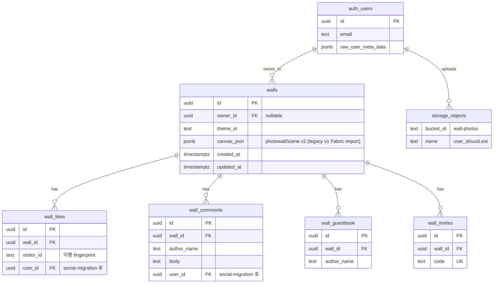
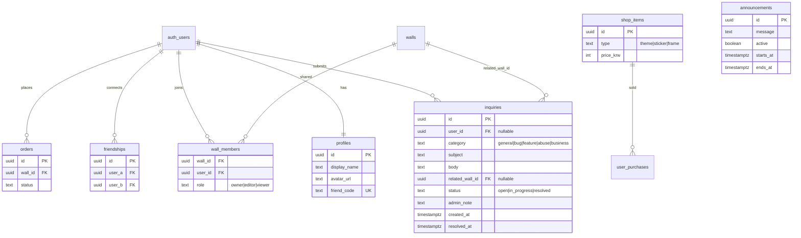

# 📸 네컷사진 디지털 포토월 서비스 (가칭)

> **한 줄 요약:** 오프라인 매장 벽면이나 내 방 벽에 네컷사진을 찢고 붙이던 아날로그 감성을 디지털 공간으로 옮겨온, **'Z세대 취향 저격 가상 벽 꾸미기(Wall-꾸) 소셜 플랫폼'**

---

## 목차

1. [프로젝트 배경 및 문제 정의](#1-프로젝트-배경-및-문제-정의)
2. [핵심 기능 및 로드맵](#2-핵심-기능-및-로드맵)
3. [추가 기능](#3-추가-기능)
4. [관리자 페이지 (Admin)](#4-관리자-페이지-admin)
5. [기술 검토](#5-기술-검토)
6. [데이터베이스 (ERD)](#6-데이터베이스-erd)
7. [진행 현황](#7-진행-현황)
8. [다음 할 일](#8-다음-할-일)
9. [변경 이력](#9-변경-이력)

---

## 1. 프로젝트 배경 및 문제 정의

### Problem

- **아날로그 트렌드의 디지털화 공백:** Z세대는 네컷사진 실물을 방 벽이나 포토매장 벽면에 마스킹 테이프로 비뚤어지게 붙이고 꾸미는 문화를 즐김. 하지만 현재 이를 만족하는 디지털 공간이 없음.

### 기존 시장의 한계

| 경쟁/유사 서비스 | 한계 |
|---|---|
| **국내 네컷 아카이빙 앱** (네컷모아 등) | 단순 고화질 저장 및 Grid/캘린더 형태의 반듯한 정렬에만 치중 → '꾸미는 재미'와 '감성' 부족 |
| **해외 무드보드 서비스** (Landing, Shuffles) | 자유로운 캔버스 UI는 제공하나, 패션/인테리어 중심의 이미지 스크랩 툴일 뿐 '개인의 오프라인 추억(네컷사진)'을 박제하는 소셜 공간이 아님 |

### Opportunity

자유도 높은 **캔버스 UI 기술** + **한국의 네컷사진 아카이빙 문화**를 결합하여, 유저가 자신의 취향과 추억을 전시하는 **'디지털 쇼룸'** 시장 개척.

---

## 2. 핵심 기능 및 로드맵

### 🛠️ 1단계: 내 방 벽꾸미기 (개인 아카이빙 MVP)

**목표:** 유저가 혼자 들어와서 사진을 업로드하고 꾸미는 것만으로도 재미를 느끼게 함.

| 기능 | 설명 | 상태 |
|---|---|---|
| 이미지 업로드 및 자유 배치 | 파일 선택 업로드 + 캔버스 내 드래그 이동 | ✅ 완료 |
| 이미지 변형 | 크기 조절, 회전(각도), 레이어 순서(z-index) 변경 | ✅ 완료 |
| 벽지 테마 선택 | 화이트, 적벽돌, 코르크보드, 우드패널, 낡은 석고, 포토부스 커튼, 파스텔, 콘크리트 (8종) | ✅ 완료 |
| 기본 꾸미기 에셋 | 마스킹 테이프 4종, 이모지 스티커 6종, SVG 스티커 6종, 펜(색상 6·굵기 3) | ✅ 완료 |
| 에디터 UI | 전체 화면 흰 캔버스 + 좌상단 메뉴 → 왼쪽 슬라이드 팝업 | ✅ 완료 |
| 벽 저장/불러오기 | localStorage + 자동 저장 (1.5초 debounce) | ✅ 완료 |
| 실행 취소/다시하기 | Undo/Redo (최대 50단계) + ⌘Z / ⌘⇧Z 단축키 | ✅ 완료 |
| 드래그 앤 드롭 업로드 | 캔버스에 이미지 끌어놓기 (다중 파일) | ✅ 완료 |
| QR 네컷 가져오기 | 인생네컷·포토이즘 QR 스캔 → 벽에 자동 붙이기 (`/import`) | 🔄 1차 완료 — 실제 부스 QR 검증 필요 |
| 모바일 최적화 | 100dvh, safe-area, 터치 핸들 확대, touch-none | ✅ 완료 |

### 🤝 2단계: 너의 벽을 보여줘 (소셜 네트워크 확장)

**목표:** 유저들이 만든 예쁜 벽을 자랑하고 소통하며 서비스 바이럴 유도.

| 기능 | 설명 | 상태 |
|---|---|---|
| 나만의 벽 고유 링크(URL) | Supabase 저장 또는 URL 인코딩 fallback (`/wall/[id]`, `/wall/share`) | ✅ 완료 |
| 방명록 사진 | 친구 벽에 네컷사진 슬쩍 붙이기 (Supabase 벽 전용) | ✅ 1차 완료 |
| 인스타 스토리 공유 | html2canvas 이미지 저장 + Web Share API | ✅ 완료 |
| 응원 댓글 & 좋아요 | 공개 벽 뷰어 하단 패널 (Supabase 벽 전용) | ✅ 1차 완료 |
| 친구 초대 | 초대 코드 링크 (`/invite/[code]`) | ✅ 1차 완료 |
| 구글 로그인 | Supabase Auth + Google OAuth — 벽 소유권·기기 간 동기화 | ✅ 완료 |
| 앱 셸 & 랜딩 | 홈·벽꾸미기·내정보·설정 하단 네비 + 랜딩 페이지 | ✅ 완료 |
| 벽 프라이버시 | `allow_wall_visits` — 친구만 내 벽 방문 (기본 비공개) | ✅ 1차 완료 |
| 공동벽 초대 수락 | `wall_member_invites` — 초대 accept/decline | ✅ 1차 완료 |
| 다크 모드 | 라이트/다크/시스템 테마 + 시맨틱 UI 토큰 | ✅ 완료 |

### 💰 3단계: 아이템 숍 오픈 (비즈니스 모델 구축)

**목표:** 트래픽을 기반으로 한 본격적인 수익화.

| 기능 | 설명 | 상태 |
|---|---|---|
| 프리미엄 꾸미기 아이템 | 움직이는 네온사인 스티커, 특별 콘셉트 가상 방 배경화면 등 | ⬜ 미착수 |
| IP 콜라보레이션 | 잔망루피, 산리오 등 인기 캐릭터·일러스트레이터 한정판 스티커/프레임 | ⬜ 미착수 |
| 굿즈 연계 | 디지털 포토월 디자인 그대로 실제 액자·롤스크린 포스터 인화 배송 | ⬜ 미착수 |

---

## 3. 추가 기능

기획 단계에서 도출된 확장 아이디어.

### 친구 초대 기능

- 초대 링크 또는 코드로 친구를 서비스에 유입 — **1차 구현 완료** (`/invite/[code]`)
- 친구 목록 관리 및 상호 방문 연결 — ✅ 1차 완료 (친구 코드, 목록, 벽 방문)
- **로드맵 배치:** 2단계 (소셜 확장)와 함께 검토

### 함께 모으는 인생네컷 (셋로그 스타일)

- 친구와 **공동 벽** 또는 **공동 앨범**을 만들어 네컷사진을 함께 수집·꾸미기
- 각자 업로드한 사진이 한 벽면에 자연스럽게 쌓이는 경험
- 오프라인에서 함께 찍은 네컷 → 디지털 공간에서 함께 아카이빙하는 흐름
- **로드맵 배치:** 2.5단계 — ✅ Konva 실시간 공동 벽 (`/shared/[id]`)

---

## 4. 관리자 페이지 (Admin)

> **상태:** ✅ 1단계 MVP 코드 완료 (SQL 마이그레이션 실행·프로덕션 env 확인 필요)
> **목표:** 특정 운영자 계정만 접근해 **문의·신고 처리**, **콘텐츠 관리**, **서비스 현황**을 한곳에서 수행

### 접근 제어

| 레이어 | 방식 |
|---|---|
| **UI** | 로그인 + allowlist 일치 시에만 설정(`/settings`) 하단에 「관리자」 버튼 노출 |
| **서버** | `/admin/*`, `/api/admin/*` — 세션 검증 + allowlist **이중 확인** (URL 직접 입력 차단) |
| **초기 allowlist** | 서버 env: `ADMIN_USER_IDS`(Supabase UUID) 또는 `ADMIN_EMAILS` (쉼표 구분) |
| **확장 (추후)** | `profiles.is_admin` 컬럼 또는 Supabase `app_metadata.role = 'admin'` |

```env
# .env (서버 전용 — Vercel Production)
ADMIN_USER_IDS=uuid1,uuid2
SUPABASE_SERVICE_ROLE_KEY=...   # admin API 전용, 클라이언트 노출 금지
```

### 화면 구성 (`/admin`)

```
/admin
├── 대시보드          ← KPI + 최근 미처리 문의
├── 문의·신고         ← 인박스 (핵심)
├── 벽 관리           ← 검색·숨김·삭제
├── 유저              ← 검색·상세
├── 공지              ← (2단계) 홈/에디터 배너
└── 설정              ← allowlist 확인 (env 또는 DB)
```

모바일에서는 **문의 확인·상태 변경** 정도만 지원, 나머지는 PC 위주.

### 기능 로드맵

#### 1단계 — MVP (우선 구현)

| 기능 | 설명 | 상태 |
|---|---|---|
| **접근 가드** | allowlist + `/admin` 레이아웃 + 설정 페이지 진입 버튼 | ✅ |
| **대시보드** | 가입자·벽(개인/공동/owner 없음)·좋아요·댓글·방명록·미처리 문의 | ✅ |
| **문의·신고 인박스** | 유저 문의 접수 + 관리자 목록·상세·상태 변경·내부 메모 | ✅ |
| **유저용 문의 폼** | 설정 → 「문의하기」; 카테고리·제목·본문 | ✅ |
| **콘텐츠 모더레이션** | 벽 검색·숨김·삭제·댓글·방명록 삭제 | ✅ |
| **신고 연동** | 벽 뷰어 「신고하기」→ `inquiries` (`category=abuse`) | ✅ |
| **유저 관리 (경량)** | 닉네임/친구코드 검색, 레거시 벽 목록 | ✅ |

**문의 카테고리**

| category | 용도 |
|---|---|
| `general` | 일반 문의·사용법 |
| `bug` | 버그 제보 (QR, 저장 실패 등) |
| `feature` | 기능 제안 |
| `abuse` | 부적절한 벽·댓글·방명록 신고 |
| `business` | 제휴·매장 연동·IP 콜라보 (3단계 로드맵 연계) |

**유저 진입점**

- 설정 → 「문의하기」
- 홈 푸터 → 「문의 · 제휴」 (2단계)
- 공개 벽 뷰어 → 「신고하기」

#### 2단계 — 운영 편의

| 기능 | 설명 | 상태 |
|---|---|---|
| **공지·점검 배너** | 홈/에디터 상단 공지 (`announcements` 테이블 또는 env) | ⬜ |
| **QR import 모니터링** | rate limit 초과·파서 실패 로그 집계 | ⬜ |
| **기능 플래그** | QR import·공동벽·방명록 등 on/off (장애 시 부분 차단) | ⬜ |
| **문의 회신** | 관리자 메모 + (선택) 이메일 또는 앱 내 알림 | ⬜ |
| **계정 정지** | 로그인 유지, 벽 공유·댓글·방명록만 차단 | ⬜ |

#### 3단계 — 성장·비즈니스 (3단계 로드맵과 연계)

| 기능 | 설명 | 상태 |
|---|---|---|
| **제휴 문의 파이프라인** | business 문의 상태: 리드 → 미팅 → 계약 | ⬜ |
| **분석** | MAU, 공유→가입 퍼널, 리텐션 | ⬜ |
| **에셋 관리** | 벽지·스티커 신규 등록/비활성 (숍 대비) | ⬜ |
| **부스 도메인 관리** | QR 허용 도메인 allowlist를 admin UI에서 편집 | ⬜ |

### API·라우트 (예정)

```
src/app/admin/                    # 관리자 UI (서버 컴포넌트 + allowlist)
src/app/api/admin/
├── stats/route.ts                # 대시보드 집계
├── inquiries/route.ts            # 문의 목록·생성(유저)
├── inquiries/[id]/route.ts       # 문의 상세·상태 변경
├── walls/route.ts                # 벽 검색
├── walls/[id]/route.ts           # 벽 숨김·삭제
├── users/route.ts                # 유저 검색
└── comments|guestbook/...        # 소셜 삭제

src/app/api/inquiries/route.ts    # 유저용 문의 POST (admin과 분리 가능)
src/lib/admin/
├── auth.ts                       # isAdmin(session), requireAdmin()
└── service-client.ts             # service role Supabase (서버 전용)
```

### DB 추가 예정 (`admin-inquiries-migration.sql`)

```sql
-- inquiries: 문의·신고 통합
create table inquiries (
  id uuid primary key default gen_random_uuid(),
  user_id uuid references auth.users(id) on delete set null,
  email text,
  category text not null,          -- general|bug|feature|abuse|business
  subject text not null,
  body text not null,
  related_wall_id uuid references walls(id) on delete set null,
  status text not null default 'open',  -- open|in_progress|resolved
  admin_note text,
  created_at timestamptz default now(),
  resolved_at timestamptz
);

-- announcements (2단계)
create table announcements (
  id uuid primary key default gen_random_uuid(),
  message text not null,
  active boolean default true,
  starts_at timestamptz,
  ends_at timestamptz,
  created_at timestamptz default now()
);
```

- **RLS:** `inquiries` insert — 로그인 유저 + rate limit; select/update — **admin API(service role)만** (일반 RLS policy 미노출)
- **walls:** `hidden_at timestamptz` 또는 `is_hidden boolean` — 모더레이션용 soft delete (1단계)

### 구현 순서 (예상)

| 순서 | 작업 | 예상 |
|---|---|---|
| 1 | `ADMIN_USER_IDS` + `requireAdmin()` + `/admin` 빈 셸 + 설정 버튼 | 0.5일 |
| 2 | `inquiries` SQL + 유저 문의 폼 + admin 인박스 | 1~2일 |
| 3 | 대시보드 집계 API | 0.5일 |
| 4 | 벽 검색·숨김·댓글/방명록 삭제 | 1일 |
| 5 | 공지 배너·import 로그·기능 플래그 | 이후 |

### PhotoWall 운영 우선순위 TOP 5

1. **문의·신고 인박스** — CS·버그·제휴를 한곳에서 처리
2. **벽/댓글 모더레이션** — 공개 URL 서비스 필수
3. **대시보드** — 혼자 운영할 때 일일 현황 파악
4. **레거시 벽 정리** — `owner_id null` 벽 귀속·정리 (`auth-migration` 잔여)
5. **QR import 모니터링** — 핵심 기능 실패율 추적

---

## 5. 기술 검토

### 프론트엔드 (Canvas UI)

| 항목 | 선택 | 비고 |
|---|---|---|
| 벽 에디터·뷰어 | **React-Konva + Zustand** | `/wall/edit`, `/shared/[id]`, `/wall/[id]` — 통합 Konva 엔진 |
| 실시간 transport | **Supabase Realtime** | Broadcast (`wall-sync`: hello/full/patch/clear) + Presence (커서) |
| 소셜 공유 캡처 | **html2canvas** | Konva wall stage DOM → PNG 저장·Web Share |
| 레거시 import | `fabric-import.ts` | v1 Fabric JSON → v2 `photowallScene` 자동 변환 (npm `fabric` 제거됨) |

### 인증 (Auth)

| 항목 | 선택 | 비고 |
|---|---|---|
| 인증 제공자 | **Supabase Auth** | 세션·JWT 관리, RLS와 연동 |
| 소셜 로그인 (1차) | **Google OAuth** | Z세대 타겟, 가입 마찰 최소화 |
| 소셜 로그인 (추후) | 카카오, Apple 등 | 국내 유저 확장 시 검토 |
| 클라이언트 연동 | `@supabase/ssr` | Next.js App Router 쿠키 세션 |

**Google 로그인 등록 절차** — ✅ 프로덕션 적용 완료

1. **Google Cloud Console** — OAuth 2.0 클라이언트 ID 생성 (웹 애플리케이션) ✅
2. **승인된 리디렉션 URI** — Supabase 콜백 URL 등록 (`https://<project>.supabase.co/auth/v1/callback`) ✅
3. **Supabase Dashboard** — Authentication → Providers → Google 활성화 (Client ID / Secret 입력) ✅
4. **앱 연동** — 로그인·로그아웃 UI, `auth.users` ↔ `walls.owner_id` 매핑, RLS 소유자 기준 ✅
5. **배포 환경** — Vercel 프로덕션 URL을 Supabase Site URL·Redirect URLs에 등록 ✅
6. **콜백 라우트** — `get-site-origin` + middleware `?code=` → `/auth/callback` 리다이렉트 ✅

**로그인 후 기대 효과**

- localStorage 벽 데이터 → 로그인 유저 계정에 클라우드 벽으로 마이그레이션·동기화
- 공개 벽 수정·삭제 권한을 벽 소유자(및 공동벽 editor)에게만 부여 ✅
- 좋아요·댓글·방명록·QR import는 로그인 필수 ✅ (2026-06-19 보안 강화)

### 기술 스택

| 영역 | 선택 | 상태 |
|---|---|---|
| 프론트엔드 | **Next.js 15 + React 19 + TypeScript** | ✅ 적용 |
| 벽 캔버스 (통합) | **react-konva + zustand** | ✅ 개인·공동·뷰어 전부 Konva |
| 스타일링 | Tailwind CSS v4 | ✅ 적용 |
| MVP 저장소 | localStorage (브라우저 로컬) | ✅ 적용 |
| 인증 | Supabase Auth + **Google OAuth** | ✅ 적용 |
| 백엔드 | Supabase (walls + 소셜 테이블) | ✅ 적용 |
| 스토리지 | Supabase Storage (`wall-photos`, private) | 🔄 코드 완료 — SQL·프로덕션 검증 |
| DB | PostgreSQL / Supabase | ✅ 스키마 작성 |
| 배포 | Vercel | ✅ 프로덕션 (`photowall-one.vercel.app`) |

### 프로젝트 구조

```
src/
├── app/
│   ├── page.tsx                      # 홈 랜딩
│   ├── wall/edit/                    # 내 벽 편집 (Konva)
│   ├── shared/[id]/                  # 공동 벽 편집 (Konva + Realtime)
│   ├── import/                       # QR 네컷 가져오기
│   ├── profile/ · settings/          # 내정보·설정
│   ├── admin/                        # 관리자 UI (allowlist)
│   ├── api/admin/                    # 관리자 API (service role)
│   ├── api/walls/[id]/signed-photos/ # Storage signed URL 발급
│   ├── api/shared-walls/             # 공동 벽 + 초대 API
│   └── wall/[id]/ · wall/share/      # 공개 벽 뷰어 (Konva read-only)
├── components/wall/
│   ├── PersonalWallKonvaEditor.tsx   # 개인 벽 진입점
│   ├── SharedWallKonvaEditor.tsx     # 공동 벽 진입점
│   ├── WallViewer.tsx                # 공개 벽 뷰어
│   ├── StickerPicker.tsx             # 스티커 카탈로그 UI
│   └── konva/                        # Konva Stage·노드·Presence
├── lib/stickers/                     # 스티커 팩 카탈로그 (basic·christmas·valentine)
├── stores/wall-scene-store.ts        # Zustand 씬 상태 + Undo/Redo
├── hooks/useWallRealtime.ts          # Supabase Broadcast ↔ store
├── lib/wall-scene/                   # v2 씬 모델·legacy import·realtime
├── lib/storage/                      # wall-photo:// · signed URL
└── types/wall-scene-v2.ts            # photowallScene 스키마
```

> **단일 Konva 아키텍처:** 개인·공동·뷰어 모두 `react-konva` + v2 `photowallScene`. DB의 v1 Fabric JSON은 로드 시 자동 import. npm `fabric`·`yjs` 의존성 제거됨.

### 현재 UI (2026-06-16)

- **Figma형 확장 벽** — 390×600 시작, 콘텐츠에 따라 자동 확장·축소, 격자 워크스페이스 + 핀치 줌
- **개인 벽 (`/wall/edit`)** — Konva: 사진·스티커·테이프·Undo·export·clear
- **공동 벽 (`/shared/[id]`)** — Konva + 실시간: 사진·스티커·테이프·Undo·export·clear·Presence
- **공개 벽 뷰어 (`/wall/[id]`)** — Konva read-only + 방명록·좋아요·신고
- **좌상단 햄버거** — 왼쪽 슬라이드 팝업 메뉴
- **설정** — 다크모드·프라이버시·문의하기·관리자 진입 (allowlist)

---

## 6. 데이터베이스 (ERD)

### SQL 마이그레이션 순서

> **참고:** `supabase/*.sql`은 **로컬 전용** (`.gitignore`). Supabase Dashboard SQL Editor에서 순서대로 실행. 파일 목록은 `.env.example` 주석 참고.

```
schema.sql → auth → storage → social → shared-walls → privacy-invites
→ security-hardening → admin-inquiries → admin-rls (+ app_admins insert)
→ storage-private → walls-select-rls
```

| 파일 | 내용 | 상태 |
|---|---|---|
| `schema.sql` ~ `security-hardening-migration.sql` | 기본 스키마·RLS | ✅ 실행 가정 |
| `admin-inquiries-migration.sql` | `inquiries` + walls `is_hidden` | 🔄 Dashboard 실행 확인 필요 |
| `admin-rls-migration.sql` + `app_admins` | 관리자 RLS | 🔄 Dashboard 실행 확인 필요 |
| `storage-private-migration.sql` | Storage private 전환 | 🔄 로컬 검증됨 / 프로덕션 확인 |
| `walls-select-rls-migration.sql` | walls SELECT RLS 강화 | 🔄 실행 확인 필요 |

### As-Is ERD (현재)



### canvas_json 내부

**v2 (Konva·현재)** — `photowallScene` envelope:

```
{ photowallScene: { meta: { version: 2, wallBounds, revision }, objects[] } }
objects[] → photo | sticker | emoji | tape | path
사진 src → wall-photo://userId/uuid.ext (Storage path ref, signed URL로 표시)
스티커 → stickerId (public/stickers/ 카탈로그 참조)
```

**v1 (레거시·Fabric)** — 로드 시 v2로 자동 import:

```
{ objects[], photowall: { version: 1, wallBounds } }
objects[] → Image | Rect | Text | Path
```

`fabric-import.ts`가 v1 JSON을 파싱해 v2로 변환. DB persist는 v2 envelope 형태.

### 기능 ↔ 테이블 매핑

| 기능 | 저장 위치 |
|---|---|
| 벽 꾸미기 | `walls.canvas_json` + `walls.theme_id` |
| Google 로그인 / 내 벽 | `walls.owner_id` → `auth.users` |
| 사진 업로드 (로그인) | `storage.objects` + `wall-photo://` ref + signed URL API |
| 링크 공유 | `walls.id` |
| URL 인코딩 공유 | DB 없음 (`/wall/share?d=...`) |
| 좋아요 / 댓글 | `wall_likes` / `wall_comments` |
| 방명록 | `wall_guestbook` + canvas_json 수정 |
| 친구 초대 | `wall_invites` |
| 프로필 / 친구 | `profiles` / `friendships` |
| 공동 벽 실시간 | Supabase Broadcast (ephemeral) + `canvas_json` persist |
| 문의·신고 | `inquiries` |
| 공지 배너 | `announcements` *(2단계)* |

### 구조적 이슈 (서비스 영향)

| 이슈 | 현재 | 추후 영향 |
|---|---|---|
| canvas_json blob | v2 photowallScene JSON | 대형 벽·동시성 최적화는 추후 |
| owner_id nullable | 레거시 벽 존재 | 소유권 불명 벽 정리 필요 |
| 소셜 ↔ auth 분리 | visitor_id / author_name | 프로필·친구 기능 시 user_id FK 필요 |
| Storage FK 없음 | URL 문자열만 연결 | 벽 삭제 시 고아 파일 |
| RLS | security-hardening + walls-select (선택) | 🔄 Storage private·SELECT RLS 잔여 확인 |

### To-Be ERD (추가 예정)



### 마이그레이션 로드맵

```
현재 → ① profiles + friendships (2단계) → ② wall_members (2.5) → ③ admin inquiries (운영) → ④ shop + orders (3단계)
```

---

## 7. 진행 현황

> **마지막 정리:** 2026-06-16 — 코드베이스 기준

### 한눈에 보기

| 영역 | 상태 | 비고 |
|---|---|---|
| 개인·공동·뷰어 (Konva) | ✅ 완료 | `/wall/edit`, `/shared/[id]`, `/wall/[id]` |
| 스티커 카탈로그 | ✅ 1차 | basic·christmas·valentine SVG 팩 |
| 소셜·친구·프라이버시 | ✅ 1차 완료 | 좋아요·댓글·방명록·초대 |
| 공동 벽 실시간 | ✅ 1차 | Broadcast + Presence — 양방향 sync·clear |
| 보안 2차 (Storage) | 🔄 코드 완료 | private + signed URL — SQL·프로덕션 E2E |
| 관리자 | ✅ 코드 완료 | SQL·`SUPABASE_SERVICE_ROLE_KEY` 확인 |
| QR 네컷 | 🔄 1차 | 실부스 QR E2E 검증 남음 |
| 펜·레이어 순서 | ⬜ 미구현 | Konva parity 잔여 |
| 수익화 (3단계) | ⬜ 미착수 | — |

### 전체 진행률

```
[기획]   ██████████ 100%
[디자인] ███████░░░  70%
[개발]   █████████░  94%  ← Konva 통합·Fabric 제거·뷰어 마이그레이션
[배포]   ████████░░  85%  ← Vercel·OAuth
[보안]   ████████░░  80%  ← Storage private 코드 완료, SQL·프로덕션 검증
[운영]   ████████░░  80%  ← Admin MVP 코드 완료
```

### 단계별 상태

| 단계 | 내용 | 상태 |
|---|---|---|
| 1단계 MVP | 내 방 벽꾸미기 + QR | 🔄 QR 실부스 검증 남음 |
| 2단계 소셜 | 공유·방문·소통·프라이버시 | ✅ 1차 완료 |
| 2.5 공동 벽 | 공동 인생네컷 + **실시간** | ✅ Konva 1차 — 펜·레이어 parity 남음 |
| 보안 | RLS 1차 ✅ / Storage private 🔄 | 코드 완료, SQL 실행 확인 |
| Admin | 문의·모더레이션·대시보드 | ✅ 코드 완료 |
| 3단계 수익화 | 아이템 숍 | ⬜ 미착수 |

### Konva 벽 — 구현 현황

| 기능 | 개인 | 공동 | 뷰어 |
|---|---|---|---|
| 사진 업로드·표시 (signed URL) | ✅ | ✅ | ✅ |
| 드래그·리사이즈·회전 | ✅ | ✅ | — |
| 스티커 카탈로그 | ✅ | ✅ | ✅ |
| 마스킹 테이프 | ✅ | ✅ | ✅ |
| Undo/Redo (50단계) | ✅ | ✅ | — |
| 이미지 export | ✅ | ✅ | ✅ |
| 벽 비우기 (clear) | ✅ | ✅ (+ realtime) | — |
| Supabase Broadcast 동기화 | — | ✅ | — |
| Presence 커서·이름 | — | ✅ | — |
| DB 자동 저장 (debounce) | ✅ | ✅ | — |
| v1 Fabric → v2 import | ✅ | ✅ | ✅ |
| 방명록 (v2) | — | — | ✅ |
| 펜 (draw) | ✅ | ✅ | — |
| 레이어 앞/뒤 | ✅ | ✅ | — |

### 최근 완료 (2026-06-16 기준)

- [x] **Konva 통합** — 개인·공동·공개 뷰어 단일 엔진 (`PersonalWallKonvaEditor`, `WallViewer`)
- [x] **스티커 카탈로그** — `StickerPack` + `public/stickers/` SVG 팩
- [x] **테이프·Undo·export·clear** — 개인·공동 parity
- [x] **실시간 양방향 sync** — Broadcast hello/full/patch/clear + auto-reconnect
- [x] **Fabric 제거** — `WallCanvas`·`WallEditor` 삭제, npm `fabric`·`yjs` 제거
- [x] **방명록 v2** — `guestbook.ts` photowallScene 기반
- [x] `wall-scene-v2` 씬 모델 + Zustand store + legacy import
- [x] Storage **private** + `wall-photo://` ref + `/signed-photos` API
- [x] 관리자 MVP (`/admin`, 문의·벽·유저·신고)

### 이전까지 완료 (요약)

- [x] Fabric MVP (테마·테이프·스티커·펜·Undo·공유) → **Konva로 대체 완료**
- [x] Google OAuth + 클라우드 저장 + Storage 업로드
- [x] 소셜 (좋아요·댓글·방명록·친구·프라이버시·공동벽 초대)
- [x] QR import 1차, Vercel 배포, 보안 강화 1차 (RLS)
- [x] Figma형 확장 벽, 앱 셸·다크모드

---

## 8. 다음 할 일

### 현재 포커스 (2026-06-16)

```
① 2-browser 실시간 QA  →  ② QR 실부스  →  ③ 스티커 콘텐츠 확장
```

| 우선순위 | 작업 | 상태 |
|---|---|---|
| **P0** | Konva 펜 (`WallScenePath` + Line) + 레이어 앞/뒤 | ✅ |
| **P1** | Supabase SQL 실행 확인 (`storage-private`, `walls-select-rls`, `admin-*`) | ✅ |
| **P1** | Vercel `SUPABASE_SERVICE_ROLE_KEY` + `ADMIN_USER_IDS` + signed-photos 200 | ✅ |
| **P2** | 2-browser 실시간 QA 체크리스트 (드래그·clear·재연결) | 🔄 진행 중 |
| **P3** | Admin 2단계 (공지 배너·import 로그·기능 플래그) | ⬜ |
| **P3** | 3단계 수익화 | ⬜ |

### Konva 벽 — 남은 작업

- [x] `/wall/edit` → `PersonalWallKonvaEditor`
- [x] `/shared/[id]` → `SharedWallKonvaEditor`
- [x] `/wall/[id]` → `WallViewer` (Konva read-only)
- [x] Supabase Broadcast + Presence (hello/full/patch/clear)
- [x] signed URL + `wall-photo://` ref
- [x] 스티커 카탈로그·테이프·Undo·export·clear
- [x] Fabric 코드·의존성 제거
- [x] 펜 (draw mode) + 레이어 zIndex reorder
- [ ] 2-browser 실시간 QA 체크리스트 통과

### 보안 2차 — 코드 ✅ / SQL·검증 🔄

- [x] Storage private + signed URL API (`/api/walls/[id]/signed-photos`)
- [x] `wall-photo://` ref 저장·로드·resolve
- [x] Konva 에디터·뷰어 연동 (Fabric 제거)
- [x] `storage-private-migration.sql` 프로덕션 적용 확인
- [x] `walls-select-rls-migration.sql` 적용 확인
- [x] 공개 Storage URL 차단 + signed-photos API 200

### 관리자 — 코드 ✅

- [x] `/admin` 가드·대시보드·문의·벽·유저
- [x] `admin-inquiries-migration.sql` · `admin-rls-migration.sql` Dashboard 실행
- [x] `app_admins` · `ADMIN_USER_IDS` 프로덕션 등록

### QR — 남은 작업

- [x] `/import` + booth API + rate limit
- [ ] 실제 부스 QR E2E
- [ ] 홈 CTA 「QR로 네컷 가져오기」

### Vercel env (Production)

| 변수 | 용도 |
|---|---|
| `NEXT_PUBLIC_SUPABASE_URL` | Supabase |
| `NEXT_PUBLIC_SUPABASE_ANON_KEY` | 클라이언트 |
| `ADMIN_USER_IDS` | 관리자 allowlist |
| `SUPABASE_SERVICE_ROLE_KEY` | signed URL·admin API |

---

## 9. 변경 이력

| 날짜 | 내용 |
|---|---|
| 2026-06-13 | 프로젝트 기획서 초안 작성, `PROJECT.md` 생성. 친구 초대·공동 인생네컷 추가 기능 반영 |
| 2026-06-13 | Next.js + Fabric.js MVP 개발 시작. 캔버스 에디터, 벽지 테마, localStorage 저장 구현 |
| 2026-06-13 | UI 개편 — 전체 화면 흰 캔버스 + 왼쪽 슬라이드 팝업 메뉴. ResizeObserver 기반 캔버스 리사이즈 적용 |
| 2026-06-13 | MVP 마무리 — 드래그앤드롭 업로드, 자동저장, Undo/Redo, 펜 옵션, 모바일 터치 최적화 |
| 2026-06-16 | MVP 완료 — SVG 스티커·공유·이미지 export 에디터 연동, `onCanvasChangeRef` 버그 수정 |
| 2026-06-16 | 2단계 1차 — Supabase 소셜 스키마, 좋아요·댓글·방명록·친구 초대, Vercel 배포 준비 |
| 2026-06-17 | Google 로그인 — `@supabase/ssr`, 클라우드 자동 저장, Storage 업로드, owner_id 수정 |
| 2026-06-17 | ERD 문서화 + 2단계 소셜 고도화 (profiles, friendships) 시작 |
| 2026-06-17 | profiles·friendships SQL·API·UI 완료, 소셜 user_id 연동 |
| 2026-06-17 | Supabase SQL 4종 마이그레이션 완료, Vercel 배포 단계 진입 |
| 2026-06-17 | 2.5단계 공동 인생네컷 POC — wall_members, 공동 벽 UI·에디터 |
| 2026-06-19 | 앱 셸·랜딩·프로필·설정·다크모드, 벽 프라이버시·초대 수락, QR 네컷 가져오기 1차 |
| 2026-06-19 | GitHub public push, Vercel 프로덕션 배포, OAuth 콜백 수정, 보안 강화 1차 (RLS + API 인증) |
| 2026-06-19 | Figma형 확장 벽 캔버스 — workspace 줌, wallBounds 저장, 벽 프레임 export, 콘텐츠 기반 확장·축소 |
| 2026-06-19 | 관리자 페이지 기획 — 접근 제어, 문의·신고, 모더레이션, 대시보드 로드맵 (`PROJECT.md` §4) |
| 2026-06-19 | 관리자 1단계 MVP — `/admin`, 문의·신고, 벽/유저 관리, 설정 문의 폼, 벽 신고 |
| 2026-06-16 | **Konva 통합 완료** — 개인·공동·뷰어 단일 엔진, 스티커 카탈로그, Fabric·yjs 제거 |
| 2026-06-16 | **공개 뷰어 Konva** — `WallViewer`, 방명록 v2, 공동벽 export/clear parity |
| 2026-06-16 | **실시간 sync 안정화** — 양방향 Broadcast, clear 이벤트, debug 로그 제거 |
| 2026-06-16 | **공동 벽 Konva** — `/shared/[id]`, v2 씬 모델, Broadcast, Presence, signed URL |
| 2026-06-16 | **보안 2차 코드** — Storage private, `wall-photo://`, signed-photos API |
| 2026-06-16 | 실시간 sync·Presence dedupe·PATCH autosave 최적화, `PROJECT.md` 진행 현황 정리 |
| 2026-06-16 | `supabase/` SQL git 미추적 — Dashboard 로컬 실행 전용 |

---

*이 문서는 프로젝트 진행에 따라 지속적으로 업데이트합니다.*
