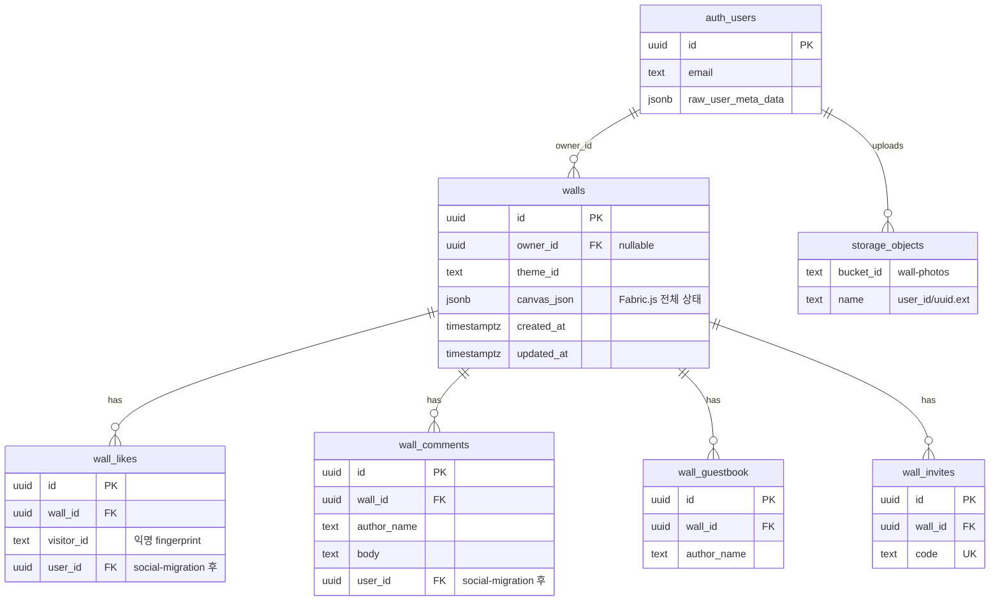
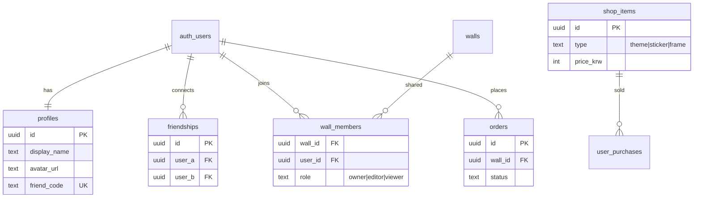

# 📸 네컷사진 디지털 포토월 서비스 (가칭)

> **한 줄 요약:** 오프라인 매장 벽면이나 내 방 벽에 네컷사진을 찢고 붙이던 아날로그 감성을 디지털 공간으로 옮겨온, **'Z세대 취향 저격 가상 벽 꾸미기(Wall-꾸) 소셜 플랫폼'**

---

## 목차

1. [프로젝트 배경 및 문제 정의](#1-프로젝트-배경-및-문제-정의)
2. [핵심 기능 및 로드맵](#2-핵심-기능-및-로드맵)
3. [추가 기능](#3-추가-기능)
4. [기술 검토](#4-기술-검토)
5. [데이터베이스 (ERD)](#5-데이터베이스-erd)
6. [진행 현황](#6-진행-현황)
7. [다음 할 일](#7-다음-할-일)
8. [변경 이력](#8-변경-이력)

---

## 1. 프로젝트 배경 및 문제 정의

### Problem

- **아날로그 트렌드의 디지털화 공백:** Z세대는 네컷사진 실물을 방 벽이나 포토매장 벽면에 마스킹 테이프로 비뚤어지게 붙이고 꾸미는 문화를 즐김. 하지만 현재 이를 만족하는 디지털 공간이 없음.

### 기존 시장의 한계

| 경쟁/유사 서비스 | 한계 |
|---|---|
| **국내 네컷 아카이빙 앱** (네컷모아 등) | 단순 고화질 저장 및 Grid/캘린더 형태의 반듯한 정렬에만 치중 → '꾸미는 재미'와 '감성' 부족 |
| **해외 무드보드 서비스** (Landing, Shuffles) | 자유로운 캔버스 UI는 제공하나, 패션/인테리어 중심의 이미지 스크랩 툴일 뿐 '개인의 오프라인 추억(네컷사진)'을 박제하는 소셜 공간이 아님 |

### Opportunity

자유도 높은 **캔버스 UI 기술** + **한국의 네컷사진 아카이빙 문화**를 결합하여, 유저가 자신의 취향과 추억을 전시하는 **'디지털 쇼룸'** 시장 개척.

---

## 2. 핵심 기능 및 로드맵

### 🛠️ 1단계: 내 방 벽꾸미기 (개인 아카이빙 MVP)

**목표:** 유저가 혼자 들어와서 사진을 업로드하고 꾸미는 것만으로도 재미를 느끼게 함.

| 기능 | 설명 | 상태 |
|---|---|---|
| 이미지 업로드 및 자유 배치 | 파일 선택 업로드 + 캔버스 내 드래그 이동 | ✅ 완료 |
| 이미지 변형 | 크기 조절, 회전(각도), 레이어 순서(z-index) 변경 | ✅ 완료 |
| 벽지 테마 선택 | 화이트, 적벽돌, 코르크보드, 우드패널, 낡은 석고, 포토부스 커튼, 파스텔, 콘크리트 (8종) | ✅ 완료 |
| 기본 꾸미기 에셋 | 마스킹 테이프 4종, 이모지 스티커 6종, SVG 스티커 6종, 펜(색상 6·굵기 3) | ✅ 완료 |
| 에디터 UI | 전체 화면 흰 캔버스 + 좌상단 메뉴 → 왼쪽 슬라이드 팝업 | ✅ 완료 |
| 벽 저장/불러오기 | localStorage + 자동 저장 (1.5초 debounce) | ✅ 완료 |
| 실행 취소/다시하기 | Undo/Redo (최대 50단계) + ⌘Z / ⌘⇧Z 단축키 | ✅ 완료 |
| 드래그 앤 드롭 업로드 | 캔버스에 이미지 끌어놓기 (다중 파일) | ✅ 완료 |
| QR 네컷 가져오기 | 인생네컷·포토이즘 QR 스캔 → 벽에 자동 붙이기 (`/import`) | 🔄 1차 완료 — 실제 부스 QR 검증 필요 |
| 모바일 최적화 | 100dvh, safe-area, 터치 핸들 확대, touch-none | ✅ 완료 |

### 🤝 2단계: 너의 벽을 보여줘 (소셜 네트워크 확장)

**목표:** 유저들이 만든 예쁜 벽을 자랑하고 소통하며 서비스 바이럴 유도.

| 기능 | 설명 | 상태 |
|---|---|---|
| 나만의 벽 고유 링크(URL) | Supabase 저장 또는 URL 인코딩 fallback (`/wall/[id]`, `/wall/share`) | ✅ 완료 |
| 방명록 사진 | 친구 벽에 네컷사진 슬쩍 붙이기 (Supabase 벽 전용) | ✅ 1차 완료 |
| 인스타 스토리 공유 | html2canvas 이미지 저장 + Web Share API | ✅ 완료 |
| 응원 댓글 & 좋아요 | 공개 벽 뷰어 하단 패널 (Supabase 벽 전용) | ✅ 1차 완료 |
| 친구 초대 | 초대 코드 링크 (`/invite/[code]`) | ✅ 1차 완료 |
| 구글 로그인 | Supabase Auth + Google OAuth — 벽 소유권·기기 간 동기화 | ✅ 완료 |
| 앱 셸 & 랜딩 | 홈·벽꾸미기·내정보·설정 하단 네비 + 랜딩 페이지 | ✅ 완료 |
| 벽 프라이버시 | `allow_wall_visits` — 친구만 내 벽 방문 (기본 비공개) | ✅ 1차 완료 |
| 공동벽 초대 수락 | `wall_member_invites` — 초대 accept/decline | ✅ 1차 완료 |
| 다크 모드 | 라이트/다크/시스템 테마 + 시맨틱 UI 토큰 | ✅ 완료 |

### 💰 3단계: 아이템 숍 오픈 (비즈니스 모델 구축)

**목표:** 트래픽을 기반으로 한 본격적인 수익화.

| 기능 | 설명 | 상태 |
|---|---|---|
| 프리미엄 꾸미기 아이템 | 움직이는 네온사인 스티커, 특별 콘셉트 가상 방 배경화면 등 | ⬜ 미착수 |
| IP 콜라보레이션 | 잔망루피, 산리오 등 인기 캐릭터·일러스트레이터 한정판 스티커/프레임 | ⬜ 미착수 |
| 굿즈 연계 | 디지털 포토월 디자인 그대로 실제 액자·롤스크린 포스터 인화 배송 | ⬜ 미착수 |

---

## 3. 추가 기능

기획 단계에서 도출된 확장 아이디어.

### 친구 초대 기능

- 초대 링크 또는 코드로 친구를 서비스에 유입 — **1차 구현 완료** (`/invite/[code]`)
- 친구 목록 관리 및 상호 방문 연결 — ✅ 1차 완료 (친구 코드, 목록, 벽 방문)
- **로드맵 배치:** 2단계 (소셜 확장)와 함께 검토

### 함께 모으는 인생네컷 (셋로그 스타일)

- 친구와 **공동 벽** 또는 **공동 앨범**을 만들어 네컷사진을 함께 수집·꾸미기
- 각자 업로드한 사진이 한 벽면에 자연스럽게 쌓이는 경험
- 오프라인에서 함께 찍은 네컷 → 디지털 공간에서 함께 아카이빙하는 흐름
- **로드맵 배치:** 2.5단계 — ✅ 1차 POC 완료 (공동 벽 생성·친구 초대·함께 꾸미기)

---

## 4. 기술 검토

### 프론트엔드 (Canvas UI)

| 항목 | 선택 | 비고 |
|---|---|---|
| 캔버스 라이브러리 | **Fabric.js v6** | ✅ 확정 — 드래그, 회전, 스케일, 펜 브러시 |
| 소셜 공유 캡처 | **html2canvas** | ✅ 적용 — 에디터·뷰어 이미지 저장 |

### 인증 (Auth)

| 항목 | 선택 | 비고 |
|---|---|---|
| 인증 제공자 | **Supabase Auth** | 세션·JWT 관리, RLS와 연동 |
| 소셜 로그인 (1차) | **Google OAuth** | Z세대 타겟, 가입 마찰 최소화 |
| 소셜 로그인 (추후) | 카카오, Apple 등 | 국내 유저 확장 시 검토 |
| 클라이언트 연동 | `@supabase/ssr` | Next.js App Router 쿠키 세션 |

**Google 로그인 등록 절차** — ✅ 프로덕션 적용 완료

1. **Google Cloud Console** — OAuth 2.0 클라이언트 ID 생성 (웹 애플리케이션) ✅
2. **승인된 리디렉션 URI** — Supabase 콜백 URL 등록 (`https://<project>.supabase.co/auth/v1/callback`) ✅
3. **Supabase Dashboard** — Authentication → Providers → Google 활성화 (Client ID / Secret 입력) ✅
4. **앱 연동** — 로그인·로그아웃 UI, `auth.users` ↔ `walls.owner_id` 매핑, RLS 소유자 기준 ✅
5. **배포 환경** — Vercel 프로덕션 URL을 Supabase Site URL·Redirect URLs에 등록 ✅
6. **콜백 라우트** — `get-site-origin` + middleware `?code=` → `/auth/callback` 리다이렉트 ✅

**로그인 후 기대 효과**

- localStorage 벽 데이터 → 로그인 유저 계정에 클라우드 벽으로 마이그레이션·동기화
- 공개 벽 수정·삭제 권한을 벽 소유자(및 공동벽 editor)에게만 부여 ✅
- 좋아요·댓글·방명록·QR import는 로그인 필수 ✅ (2026-06-19 보안 강화)

### 기술 스택

| 영역 | 선택 | 상태 |
|---|---|---|
| 프론트엔드 | **Next.js 15 + React 19 + TypeScript + Fabric.js** | ✅ 적용 |
| 스타일링 | Tailwind CSS v4 | ✅ 적용 |
| MVP 저장소 | localStorage (브라우저 로컬) | ✅ 적용 |
| 인증 | Supabase Auth + **Google OAuth** | ✅ 적용 |
| 백엔드 | Supabase (walls + 소셜 테이블) | ✅ 적용 |
| 스토리지 | Supabase Storage (`wall-photos`) | ✅ 적용 (로그인 시) |
| DB | PostgreSQL / Supabase | ✅ 스키마 작성 |
| 배포 | Vercel | ✅ 프로덕션 배포 (`photowall-one.vercel.app`) |

### 프로젝트 구조

```
src/
├── app/
│   ├── page.tsx                 # 홈 랜딩 (HomePage)
│   ├── wall/edit/               # 내 벽 편집
│   ├── shared/[id]/           # 공동 벽 편집
│   ├── import/                  # QR 네컷 가져오기
│   ├── profile/                 # 내정보 (친구·공동벽)
│   ├── settings/                # 설정 (테마·프라이버시)
│   ├── api/walls/               # 벽 CRUD API
│   ├── api/import/booth-photo/  # 포토부스 QR → 이미지 추출
│   ├── api/shared-walls/        # 공동 벽 + 초대 API
│   ├── api/friends/             # 친구 API
│   ├── api/profile/             # 프로필 API
│   ├── wall/[id]/               # 공개 벽 뷰어 (Supabase)
│   ├── wall/share/              # URL 인코딩 공유 뷰어
│   └── invite/[code]/           # 초대 링크 리다이렉트
├── components/
│   ├── layout/AppShell.tsx      # 헤더 + 하단 네비
│   ├── home/HomePage.tsx        # 랜딩
│   └── wall/                    # 에디터·뷰어·툴바
├── lib/
│   ├── booth-import/            # QR 부스 URL 파싱·허용 도메인
│   └── supabase/                # Supabase 클라이언트·DB·접근 제어
└── providers/ThemeProvider.tsx    # 다크 모드
```

### 현재 UI (2026-06-16)

- **전체 화면 흰 캔버스** — ResizeObserver 기반 자동 리사이즈
- **좌상단 햄버거 버튼** — 왼쪽 슬라이드 팝업 메뉴
- **팝업 메뉴** — 사진 업로드, 벽지(8종), 테이프, SVG·이모지 스티커, 공유·초대·이미지 저장, 도구, 저장/전체 지우기
- **공개 벽 뷰어** — 응원하기 패널 (좋아요, 댓글, 방명록 사진)
- **토스트** — 저장/공유/초대 상태 표시

---

## 5. 데이터베이스 (ERD)

### SQL 마이그레이션 순서

```
schema.sql
  → auth-migration.sql
  → storage-migration.sql
  → social-migration.sql
  → shared-walls-migration.sql
  → privacy-invites-migration.sql
  → security-hardening-migration.sql   ← 최신
```

| 파일 | 내용 | 미실행 시 영향 |
|---|---|---|
| [`schema.sql`](supabase/schema.sql) | walls + 소셜 4테이블 + MVP RLS | DB 없음 |
| [`auth-migration.sql`](supabase/auth-migration.sql) | `owner_id` + 소유권 RLS | owner_id null, 누구나 수정 |
| [`storage-migration.sql`](supabase/storage-migration.sql) | `wall-photos` 버킷 | Storage 업로드 실패 |
| [`social-migration.sql`](supabase/social-migration.sql) | profiles + friendships | 친구·프로필 불가 |
| [`shared-walls-migration.sql`](supabase/shared-walls-migration.sql) | wall_members + is_shared | 공동 벽 불가 |
| [`privacy-invites-migration.sql`](supabase/privacy-invites-migration.sql) | allow_wall_visits + wall_member_invites | 벽 비공개·초대 수락 불가 |
| [`security-hardening-migration.sql`](supabase/security-hardening-migration.sql) | RLS 강화 — 익명 insert/update 차단, 소셜·초대 인증 | API 우회 스팸·무명 벽 수정 가능 |

### As-Is ERD (현재)



### canvas_json 내부 (정규화 테이블 없음)

```
walls.canvas_json
├── version, width, height
└── objects[]  →  Image(photo) | Rect(tape) | Text(sticker) | Path(drawing)
```

사진 URL은 Storage 또는 data URL이 문자열로 포함됩니다. **walls ↔ storage FK 없음.**

### 기능 ↔ 테이블 매핑

| 기능 | 저장 위치 |
|---|---|
| 벽 꾸미기 | `walls.canvas_json` + `walls.theme_id` |
| Google 로그인 / 내 벽 | `walls.owner_id` → `auth.users` |
| 사진 업로드 (로그인) | `storage.objects` + canvas JSON URL |
| 링크 공유 | `walls.id` |
| URL 인코딩 공유 | DB 없음 (`/wall/share?d=...`) |
| 좋아요 / 댓글 | `wall_likes` / `wall_comments` |
| 방명록 | `wall_guestbook` + canvas_json 수정 |
| 친구 초대 | `wall_invites` |
| 프로필 / 친구 | `profiles` / `friendships` | ✅ 1차 구현 |

### 구조적 이슈 (서비스 영향)

| 이슈 | 현재 | 추후 영향 |
|---|---|---|
| canvas_json blob | Fabric.js JSON 전체 저장 | 벽 커질수록 성능·동시성 이슈 |
| owner_id nullable | 레거시 벽 존재 | 소유권 불명 벽 정리 필요 |
| 소셜 ↔ auth 분리 | visitor_id / author_name | 프로필·친구 기능 시 user_id FK 필요 |
| Storage FK 없음 | URL 문자열만 연결 | 벽 삭제 시 고아 파일 |
| RLS | ~~소셜 INSERT 공개~~ → 인증 필수 (`security-hardening`) | Storage public read·프로필 전체 공개는 잔여 |

### To-Be ERD (추가 예정)



### 마이그레이션 로드맵

```
현재 → ① profiles + friendships (2단계) → ② wall_members (2.5 공동벽) → ③ shop + orders (3단계)
```

---

## 6. 진행 현황

### 전체 진행률

```
[기획]   ██████████ 100%
[디자인] ███████░░░  70%  ← 앱 셸·랜딩·다크모드 1차
[개발]   █████████░  95%  ← MVP + 2단계 + 2.5 + QR 1차
[배포]   ████████░░  85%  ← Vercel·GitHub·OAuth·RLS 보안 강화 완료
[보안]   ███████░░░  75%  ← RLS·API 인증 1차 / Storage·프로필 공개 잔여
```

### 단계별 상태

| 단계 | 내용 | 상태 |
|---|---|---|
| 기획 | 서비스 컨셉, 문제 정의, 로드맵 수립 | ✅ 완료 |
| 리서치 | Z세대 벽지·꾸미기 아이템 컨셉 | ⬜ 미착수 |
| 기술 POC | Fabric.js 캔버스 에디터 | ✅ 완료 |
| UI/UX | 앱 셸 + 랜딩 + 에디터 + 다크모드 | ✅ 1차 완료 |
| MVP 개발 | 1단계 — 내 방 벽꾸미기 + QR 가져오기 | 🔄 QR 실부스 검증 남음 |
| 소셜 확장 | 2단계 — 공유·방문·소통·프라이버시 | 🔄 진행 중 (~92%) |
| 공동 벽 | 2.5단계 — 공동 인생네컷 | 🔄 1차 완료 — 실시간 동기화 미착수 |
| 보안 | Public repo + Supabase RLS·API | ✅ 1차 완료 (`security-hardening-migration.sql`) |
| 수익화 | 3단계 — 아이템 숍 | ⬜ 미착수 |

### 완료된 항목

- [x] 서비스 컨셉 및 한 줄 정의 정리
- [x] 문제 정의 및 경쟁 서비스 분석
- [x] 3단계 로드맵 초안 수립
- [x] 추가 기능 아이디어 정리 (친구 초대, 공동 인생네컷)
- [x] 기술 검토 포인트 정리 (Canvas, DB, 캡처)
- [x] 프로젝트 문서 (`PROJECT.md`) 생성
- [x] Next.js 프로젝트 초기 세팅 (TypeScript, Tailwind, ESLint)
- [x] Fabric.js 캔버스 에디터 POC (업로드, 드래그, 회전, 스케일, z-index)
- [x] 벽지 테마 4종 적용 (코르크보드, 콘크리트, 파스텔, 화이트)
- [x] 마스킹 테이프 4종, 이모지 스티커, 펜 도구 1차 탑재
- [x] localStorage 벽 데이터 저장/불러오기
- [x] 전체 화면 흰 캔버스 UI (ResizeObserver 기반 자동 리사이즈)
- [x] 왼쪽 슬라이드 팝업 메뉴 (햄버거 버튼, 딤 오버레이, ESC 닫기)
- [x] 드래그 앤 드롭 이미지 업로드 (다중 파일, 드롭 위치 배치)
- [x] 모바일 반응형 (100dvh, safe-area, 터치 핸들·터치 영역 확대)
- [x] 펜 색상 6종 · 굵기 3단계 선택
- [x] 자동 저장 (1.5초 debounce) + Undo/Redo + Delete 단축키
- [x] SVG 스티커 6종 + 에디터 연동
- [x] 벽지 테마 8종 확장
- [x] 링크 공유 (Supabase + URL 인코딩 fallback)
- [x] 인스타용 이미지 저장 (html2canvas)
- [x] 공개 벽 페이지 (`/wall/[id]`, `/wall/share`)
- [x] 친구 초대 링크 (`/invite/[code]`)
- [x] 좋아요·응원 댓글·방명록 사진 (Supabase 벽)
- [x] Vercel 배포 설정 (`vercel.json`)
- [x] profiles + friendships SQL (`social-migration.sql`)
- [x] 친구 코드·목록·벽 방문 UI (`FriendsPanel`)
- [x] 소셜 user_id 연동 (좋아요·댓글·방명록)
- [x] 앱 셸 (홈·벽꾸미기·내정보·설정 하단 네비)
- [x] 홈 랜딩 페이지 + `/wall/edit` 라우트 분리
- [x] 프로필·설정 페이지 (다크모드, 벽 방문 프라이버시)
- [x] 벽 프라이버시 (`allow_wall_visits`) + 비공개 벽 UI
- [x] 공동벽 초대 수락/거절 (`wall_member_invites`)
- [x] QR 네컷 가져오기 1차 (`/import`, 부스 API, 캔버스 자동 붙이기)
- [x] SVG 스티커 로딩 버그 수정 + 다크모드 UI 토큰 정리
- [x] GitHub public repo 연동 (`KeunwooKim/PhotoWall`)
- [x] Vercel 프로덕션 배포 (`https://photowall-one.vercel.app`)
- [x] Supabase Site URL·Redirect URLs 프로덕션 등록 + Google OAuth 프로덕션 동작
- [x] OAuth 콜백 수정 (`get-site-origin`, middleware, auth_error 배너)
- [x] 보안 강화 1차 — `security-hardening-migration.sql` + API JWT 연동
- [x] 좋아요·댓글·방명록·QR import·초대 생성 — 로그인 필수 + booth import rate limit

---

## 7. 다음 할 일

### 현재 포커스 (2026-06-19 기준)

```
① QR 실부스 검증  →  ② 공동벽 실시간 동기화  →  ③ 보안 2차 (Storage·프로필)  →  ④ 스티커 확장
```

| 우선순위 | 작업 | 이유 | 예상 |
|---|---|---|---|
| **P0** | QR 가져오기 — **실제 인생네컷/포토이즘 QR**로 E2E 테스트 | Google Drive QR 등은 지원 대상 아님. `life4cut.com`, `qr.seobuk.kr` 파서 검증 필요 | 1~2시간 |
| **P1** | 공동 벽 실시간 동기화 (Supabase Realtime 또는 polling) | 현재는 저장 시에만 반영 — 함께 꾸미기 UX 핵심 | 1~2일 |
| **P1** | 홈 랜딩에「QR로 네컷 가져오기」CTA 추가 | 모바일 유입 경로 강화 | 30분 |
| **P2** | 보안 2차 — Storage private + signed URL, friend_code 조회 제한 | Public repo·anon key 환경 잔여 리스크 | 0.5~1일 |
| **P2** | 스티커 에셋 확장 (OpenMoji/Twemoji 등) | 보류 중 — 리서치만 완료 | 0.5~1일 |
| **P3** | 3단계 수익화 (프리미엄 아이템) | 트래픽·리텐션 확보 후 | — |

### QR 가져오기 — 남은 작업

- [x] `/import` QR 스캐너 + 링크 입력 UI
- [x] `/api/import/booth-photo` 서버 fetch + HTML 파싱
- [x] 허용 도메인 (`life4cut.com`, `seobuk.kr`, `lkventures.co.kr` 등)
- [x] 벽 에디터 자동 붙이기 (sessionStorage → canvas)
- [x] 로그인 필수 + IP rate limit (10회/분)
- [ ] **실제 부스 QR**로 성공 경로 검증 (만료·잘못된 QR 오류 UX 포함)
- [ ] 부스별 HTML 파서 보강 (이미지 추출 실패 시)

**테스트 참고:** Google Drive·임의 URL QR은 의도적으로 차단됨 (SSRF 방지). 테스트는 실제 네컷 QR 또는「네컷 사진 올리기」업로드 사용.

### 권장 진행 순서 (레거시)

```
[SQL ✅] → [Git/Vercel ✅] → [보안 1차 ✅] → [QR 실부스 검증] → [공동벽 Realtime] → [수익화]
```

### Vercel 배포 — ✅ 완료

| 항목 | 값 |
|---|---|
| GitHub | `https://github.com/KeunwooKim/PhotoWall` (public) |
| Vercel | `https://photowall-one.vercel.app` |
| Git 연동 | push → 자동 배포 |
| Env | `NEXT_PUBLIC_SUPABASE_URL`, `NEXT_PUBLIC_SUPABASE_ANON_KEY` (Production) |

#### 배포 후 확인 체크리스트

- [x] 메인 페이지 로드
- [x] Google 로그인 → `/auth/callback` → 메인 복귀
- [x] 벽 꾸미기 + 클라우드 자동 저장
- [x] 링크 공유 (`/wall/[id]`)
- [x] 친구 코드 추가·벽 방문
- [ ] QR 네컷 가져오기 (실제 부스 QR)
- [ ] 로그인 후 좋아요·댓글·방명록 (보안 강화 후)

### 보안 1차 — ✅ 완료 (2026-06-19)

| 항목 | 내용 |
|---|---|
| SQL | `security-hardening-migration.sql` — walls 익명 update 차단, 소셜·초대 인증 필수 |
| API | social mutation → 사용자 JWT 클라이언트, booth import 로그인 + rate limit |
| Git | `.env.local`·`google_Client` gitignore, service_role 미사용 |

#### 보안 2차 (잔여)

- [ ] Storage `wall-photos` → private + signed URL
- [ ] `profiles_select_public` → 친구 관계 있는 경우만 friend_code 조회
- [ ] GitHub Secret scanning 활성화

### 1단계 MVP — 완료

- [x] 모바일 반응형 캔버스 + 터치 조작 최적화
- [x] 이미지 드래그 앤 드롭 업로드
- [x] 펜 색상·굵기 선택
- [x] UX 개선 (자동 저장, Undo/Redo, Delete 키 단축키)
- [x] SVG 스티커 에셋 추가 및 에디터 연동

### Pre-MVP / 기획

- [ ] 메인 타겟층(Z세대) 선호 벽지 및 꾸미기 아이템 컨셉 리서치
- [ ] 서비스명(가칭) 확정 — 현재 임시명: **PhotoWall**

### 인증 — Google 로그인

- [x] Google Cloud Console OAuth 클라이언트 ID·Secret 발급
- [x] Supabase Auth에서 Google Provider 활성화
- [x] `@supabase/ssr` 설치 및 Next.js 미들웨어·콜백 라우트 구성 (`/auth/callback`)
- [x] 로그인·로그아웃 UI (에디터·뷰어 헤더)
- [x] `supabase/auth-migration.sql` 실행 (`owner_id` + RLS)
- [x] localStorage 벽 → 로그인 후 클라우드 벽 마이그레이션 UX
- [x] 로그인 시 클라우드 자동 저장
- [x] Vercel URL을 Google OAuth·Supabase Redirect에 등록

### 인프라 & 배포

- [x] Supabase 스키마 작성 (walls + likes + comments + guestbook + invites)
- [x] Supabase API 연동 (벽 저장·조회)
- [x] Supabase 프로젝트 생성 및 `.env.local` 환경변수 설정
- [x] 클라우드 이미지 스토리지 (Supabase Storage — 로그인 시 업로드)
- [x] `supabase/storage-migration.sql` 실행
- [x] Vercel 배포 설정 파일
- [x] Vercel 실제 배포 (`photowall-one.vercel.app`)
- [x] GitHub repo + Vercel Git 자동 배포
- [x] `security-hardening-migration.sql` 실행

### 2단계 — 소셜 확장

- [x] 고유 URL 및 공개 벽 페이지 (`/wall/[id]`)
- [x] 인스타 스토리 공유 (html2canvas)
- [x] 친구 초대 기능 (초대 코드 링크)
- [x] 방명록 사진, 좋아요/댓글 (1차)
- [x] Google 로그인 (Supabase Auth + Google OAuth)
- [x] `auth-migration.sql` / `storage-migration.sql` / `social-migration.sql` 실행
- [x] **profiles + friendships** (친구 코드·목록·벽 방문)
- [x] 소셜 user_id 연동 (좋아요·댓글·방명록)

### 2.5단계 — 공동 인생네컷

- [x] `wall_members` + `is_shared` SQL (`shared-walls-migration.sql`)
- [x] 공동 벽 생성·친구 초대 API
- [x] 공동 벽 패널 UI + `/shared/[id]` 에디터
- [x] 초대 수락/거절 (`privacy-invites-migration.sql`)
- [x] `privacy-invites-migration.sql` Supabase 실행
- [ ] 실시간 동기화 (다음 단계 — 현재는 저장 시 반영)

### 1.5단계 — QR 네컷 가져오기

- [x] 모바일 QR 스캔 페이지 (`/import`)
- [x] 포토부스 URL 허용 목록 + HTML 파서
- [x] 벽 에디터 자동 붙이기
- [ ] 실제 부스 QR E2E 검증

### 3단계 — 수익화

- [ ] 프리미엄 꾸미기 아이템 숍
- [ ] IP 콜라보레이션
- [ ] 굿즈 연계 (액자·포스터 인화)

---

## 8. 변경 이력

| 날짜 | 내용 |
|---|---|
| 2026-06-13 | 프로젝트 기획서 초안 작성, `PROJECT.md` 생성. 친구 초대·공동 인생네컷 추가 기능 반영 |
| 2026-06-13 | Next.js + Fabric.js MVP 개발 시작. 캔버스 에디터, 벽지 테마, localStorage 저장 구현 |
| 2026-06-13 | UI 개편 — 전체 화면 흰 캔버스 + 왼쪽 슬라이드 팝업 메뉴. ResizeObserver 기반 캔버스 리사이즈 적용 |
| 2026-06-13 | MVP 마무리 — 드래그앤드롭 업로드, 자동저장, Undo/Redo, 펜 옵션, 모바일 터치 최적화 |
| 2026-06-16 | MVP 완료 — SVG 스티커·공유·이미지 export 에디터 연동, `onCanvasChangeRef` 버그 수정 |
| 2026-06-16 | 2단계 1차 — Supabase 소셜 스키마, 좋아요·댓글·방명록·친구 초대, Vercel 배포 준비 |
| 2026-06-17 | Google 로그인 — `@supabase/ssr`, 클라우드 자동 저장, Storage 업로드, owner_id 수정 |
| 2026-06-17 | ERD 문서화 + 2단계 소셜 고도화 (profiles, friendships) 시작 |
| 2026-06-17 | profiles·friendships SQL·API·UI 완료, 소셜 user_id 연동 |
| 2026-06-17 | Supabase SQL 4종 마이그레이션 완료, Vercel 배포 단계 진입 |
| 2026-06-17 | 2.5단계 공동 인생네컷 POC — wall_members, 공동 벽 UI·에디터 |
| 2026-06-19 | 앱 셸·랜딩·프로필·설정·다크모드, 벽 프라이버시·초대 수락, QR 네컷 가져오기 1차 |
| 2026-06-19 | GitHub public push, Vercel 프로덕션 배포, OAuth 콜백 수정, 보안 강화 1차 (RLS + API 인증) |

---

*이 문서는 프로젝트 진행에 따라 지속적으로 업데이트합니다.*
