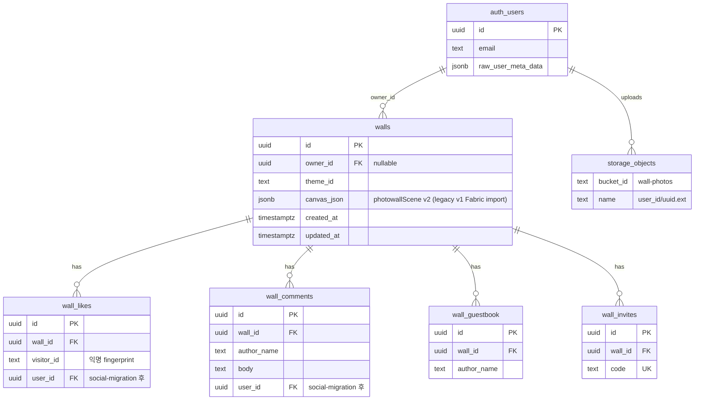
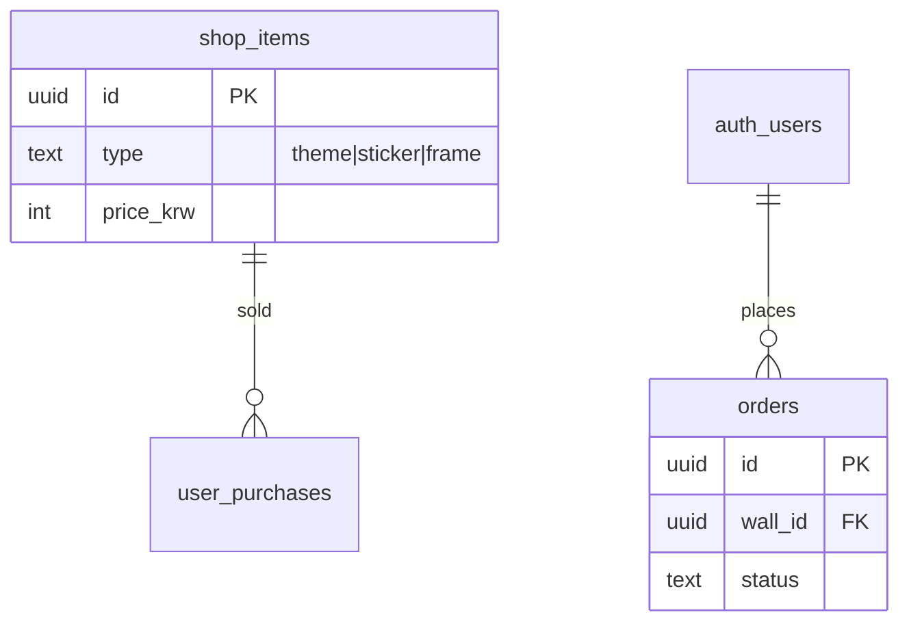

# 📸 PhotoWall — 네컷사진 디지털 포토월

> **한 줄 요약:** 오프라인 매장 벽면이나 내 방 벽에 네컷사진을 찢고 붙이던 아날로그 감성을 디지털 공간으로 옮겨온, **'Z세대 취향 저격 가상 벽 꾸미기(Wall-꾸) 소셜 플랫폼'**
>
> **라이브:** [https://photowall.kr](https://photowall.kr) — Cloudflare → Ubuntu + PM2 (`photowall`)  
> **점검일:** 2026-08-14 — 코드·라우트·쿼터·운영을 이 문서에 동기화. 네컷 시행착오는 [`docs/four-cut-trial.md`](docs/four-cut-trial.md)

---

## 목차

1. [프로젝트 배경 및 문제 정의](#1-프로젝트-배경-및-문제-정의)
2. [핵심 기능 및 로드맵](#2-핵심-기능-및-로드맵)
3. [추가 기능](#3-추가-기능)
4. [관리자 페이지 (Admin)](#4-관리자-페이지-admin)
5. [기술 검토](#5-기술-검토)
6. [데이터베이스 (ERD)](#6-데이터베이스-erd)
7. [진행 현황](#7-진행-현황)
8. [Figma 대비 점검](#8-figma-대비-점검)
9. [다음 할 일](#9-다음-할-일)
10. [변경 이력](#10-변경-이력)

---

## 1. 프로젝트 배경 및 문제 정의

### Problem

- **아날로그 트렌드의 디지털화 공백:** Z세대는 네컷사진 실물을 방 벽이나 포토매장 벽면에 마스킹 테이프로 비뚤어지게 붙이고 꾸미는 문화를 즐김. 하지만 현재 이를 만족하는 디지털 공간이 없음.

### 기존 시장의 한계

| 경쟁/유사 서비스 | 한계 |
|---|---|
| **국내 네컷 아카이빙 앱** (네컷모아 등) | 단순 고화질 저장 및 Grid/캘린더 형태의 반듯한 정렬에만 치중 → '꾸미는 재미'와 '감성' 부족 |
| **해외 무드보드 서비스** (Landing, Shuffles) | 자유로운 캔버스 UI는 제공하나, 패션/인테리어 중심의 이미지 스크랩 툴일 뿐 '개인의 오프라인 추억(네컷사진)'을 박제하는 소셜 공간이 아님 |

### Opportunity

자유도 높은 **캔버스 UI 기술** + **한국의 네컷사진 아카이빙 문화**를 결합하여, 유저가 자신의 취향과 추억을 전시하는 **'디지털 쇼룸'** 시장 개척.

### 현재 서비스 스냅샷 (2026-08-14)

개인 벽·공동 벽·공개 뷰어가 **Pixi 기본**으로 동작한다 (`NEXT_PUBLIC_WALL_RENDERER=konva`로 롤백). 게스트는 로그인 없이 `/wall/edit`에서 꾸미고, 로그인하면 클라우드로 붙는다. 수익은 **플러스(수동 부여)** + **AdSense / 하우스 배너**. UGC 스티커 스토어는 코드만 있고 공개 게이트는 꺼져 있다.

| 구분 | 라이브 |
|---|---|
| 앱 홈 | `/` 로그인 시 홈, 비로그인 시 마케팅 랜딩. `/home` · `/about` · `/news` · `/support` |
| 벽 | `/wall/edit` 개인, `/shared/[id]` 공동, `/wall/[id]` 열람, `/walls` 허브, `/invite/[code]` |
| 사진 | `/capture` 스캔, `/import` 부스 QR, 에디터 자르기·프레임·색보정·업스케일·네컷 |
| 계정 | `/profile` · `/settings` · `/upgrade` · `/legal/terms` · `/legal/privacy` |
| 관리자 | `/admin` — 문의·벽·유저·플랜·공지·이벤트·광고·스티커팩 심사·기능 플래그 |
| 미공개 | `/stickers/*` — `STICKER_STORE_ENABLED=false` → `/` 리다이렉트 |

---

## 2. 핵심 기능 및 로드맵

### 🛠️ 1단계: 내 방 벽꾸미기 (개인 아카이빙 MVP)

**목표:** 유저가 혼자 들어와서 사진을 업로드하고 꾸미는 것만으로도 재미를 느끼게 함.

| 기능 | 설명 | 상태 |
|---|---|---|
| 이미지 업로드 및 자유 배치 | 파일 선택 업로드 + 캔버스 내 드래그 이동 | ✅ 완료 |
| 이미지 변형 | 크기 조절, 회전(각도), 레이어 순서(z-index) 변경 | ✅ 완료 |
| PPT형 선택·정렬 | 다중 선택, 전체 선택, 정렬 6종, 벽 가운데, 복제, 화살표 미세 이동, 균등 배치, 뒤집기, 복사/붙여넣기, 스냅 가이드, 그룹, 격자, 컨텍스트 메뉴 | ✅ Phase A–D (레이어 패널 UI는 제거, z-order는 메뉴로) |
| 벽지 테마 선택 | 이미지 벽지 **5종** (매직파티션·린넨 크림·하얀 벽돌·적 벽돌·코르크보드). 구 theme ID는 자동 매핑 | ✅ |
| 기본 꾸미기 에셋 | 테이프(끝 3·패턴 5·솔리드/패턴 프리셋), 펜(볼펜/만년필/마카/붓펜, 색 10), 텍스트 폰트 10종, 스티커 팩 6 (basic·cute·season·life·party·mudo) | ✅ |
| 사진 프레임 | 폴라로이드·흰여백·검정·필름 + 체크/레오파드/타이거 등 listed **17종**. 네컷과는 겹치지 않음 | ✅ |
| 사진 편집 | 자르기(크롭), 색 보정, 화질 업스케일. **네컷**은 칸별 팬/줌 + 흰색·검정 테마 + 사진 분리하기 | ✅ 완료 (칸 자르기 2026-08-14) |
| AI 사진 스캔 | `/capture` — 카메라/갤러리 → ONNX DocAligner 코너 → warp·보정 → 벽에 붙이기 | ✅ 1차 완료 |
| 게스트 체험 | 로그인 없이 `/wall/edit` 진입 → 작업 후 로그인 시 클라우드 마이그레이션 | ✅ 완료 |
| 로딩 UI | `WallLoadingOverlay` — 데이터 fetch·렌더러 hydrate 통합 | ✅ 완료 |
| 줌·패닝 | 핀치/Ctrl+휠 줌 (0.5×–4×), 두 손가락 패닝, 줌 리셋 버튼 | ✅ 완료 |
| 에디터 UI | 데스크톱: 툴 레일 + 에셋 + 속성 사이드바 / 모바일: 하단 독 + 선택 가로 바 + 햄버거 메뉴 | ✅ 완료 |
| 벽 저장/불러오기 | localStorage + 자동 저장 (1.5초 debounce) + 클라우드 | ✅ 완료 |
| 실행 취소/다시하기 | Undo/Redo (최대 50단계) + ⌘Z / ⌘⇧Z 단축키 | ✅ 완료 |
| 드래그 앤 드롭 업로드 | 캔버스에 이미지 끌어놓기 (다중 파일) | ✅ 완료 |
| QR 네컷 가져오기 | 인생네컷·포토이즘 QR 스캔 → 벽에 자동 붙이기 (`/import`) | 🔄 1차 완료 — 실제 부스 QR 검증 필요 |
| 모바일 최적화 | 100dvh, safe-area, 터치 핸들 확대, touch-none | ✅ 완료 |
| 벽 밖 복구 | 드래그/변형 클램프 + 「벽으로 가져오기」 | ✅ 완료 |
| 네컷 스트립 | 업로드 감지(세로 4칸·2×2) → 테마(흰색/검정, 2×6·4×6) → 칸 1–4 자르기 → 4장 분리 | ✅ 1차 (2026-08-14). 시행착오: [`docs/four-cut-trial.md`](docs/four-cut-trial.md) |

### 네컷 스트립 — 동작 계약 (2026-08-14)

한 장짜리 부스 인화를 벽에 붙인 뒤의 편집. **새 크롭 필드 없음** — 칸 내용은 `photo.fourCut.windows[i]`.

| 동작 | 결과 |
|---|---|
| 업로드 감지 | `layout` + `windows` + `baseWindows`(감지 원본). 박스 비율은 세로 **2×6**, 2×2 **4×6** |
| 테마 흰색/검정 | 크롬 분율 구멍에 `cover` blit. 네컷은 폴라로이드 `frameId`와 겹치지 않음 |
| 자르기 / 더블탭 | 네컷이면 **칸 자르기** (1–4). 구멍 고정, 칸 안에서만 팬·줌. 적용 시 박스 `x/y/width/height` 불변 |
| 원본 (칸) | 그 칸만 `baseWindows[i]`로 복구 |
| 사진 분리하기 | 벽에 4장으로 떼어 붙임. 이후 각 장은 일반 자르기 |
| 원본 (테마 크기) | 테마 적용 전 크기를 **현재 중심**에 복구 (`boxKeepCenter`) |

하지 않음: 분리된 4장을 다시 한 장으로 합치기, 구멍 크기/위치 편집, 네컷 전체 스트립 크롭.

### 🤝 2단계: 너의 벽을 보여줘 (소셜 네트워크 확장)

**목표:** 유저들이 만든 예쁜 벽을 자랑하고 소통하며 서비스 바이럴 유도.

| 기능 | 설명 | 상태 |
|---|---|---|
| 나만의 벽 고유 링크(URL) | Supabase 저장 또는 URL 인코딩 fallback (`/wall/[id]`, `/wall/share`) | ✅ 완료 |
| 방명록 사진 | 친구 벽에 네컷사진 슬쩍 붙이기 (Supabase 벽 전용) | ✅ 1차 완료 |
| 인스타 스토리 공유 | 뷰어 「인스타로 저장」 — 비율 맞춤 캡처 + html2canvas fallback + Web Share | ✅ 완료 |
| 응원 댓글 & 좋아요 | 공개 벽 뷰어 하단 패널 (Supabase 벽 전용) | ✅ 1차 완료 |
| 친구 초대 | 초대 코드 링크 (`/invite/[code]`) | ✅ 1차 완료 |
| 구글 로그인 | Supabase Auth + Google OAuth — 벽 소유권·기기 간 동기화 | ✅ 완료 |
| 앱 셸 & 랜딩 | 홈·벽꾸미기·내정보·설정 하단 네비 + 랜딩 페이지 | ✅ 완료 |
| 벽 프라이버시 | `allow_wall_visits` — 친구만 내 벽 방문 (기본 비공개) | ✅ 1차 완료 |
| 공동벽 초대 수락 | `wall_member_invites` — 초대 accept/decline | ✅ 1차 완료 |
| 다크 모드 | 라이트/다크/시스템 테마 + 시맨틱 UI 토큰 | ✅ 완료 |
| Presence (세션 단위) | 같은 계정·다른 기기에서도 선택 테두리·소프트락 표시 | ✅ 완료 |

### 💰 3단계: 수익화

**목표:** 트래픽을 광고·구독으로 받고, 이후 아이템 숍·IP로 확장.

| 기능 | 설명 | 상태 |
|---|---|---|
| **플러스 요금제** | UI명 「플러스」(`premium`). 월 ₩3,900 / 연 ₩39,000. 결제는 미연동 — `/upgrade`에서 문의(`business`) → `/admin/plans` 수동 부여 (7/30/90/365일·무기한) | ✅ |
| **쿼터** | 기본: 객체 80 · 씬 2.5MB · 사진 8MB · 스토리지 150MB · 공동 벽 1. 플러스: 500 · 16MB · 30MB · 5GB · 공동 벽 5. 펜/테이프/이모지는 개수 제외 | ✅ `wall-quotas.ts` |
| **Google AdSense** | 홈 슬롯, 플러스 계정 숨김, 플래그 `adsense` | ✅ |
| **하우스 배너** | `/admin/banners` CRUD, 배치 home/settings/walls, 플래그 `house_banners` | ✅ |
| **스티커 스토어 (UGC)** | 생성·설치·심사 API·UI 있음. `STICKER_STORE_ENABLED=false`라 `/stickers/*`는 비공개 | 🔄 코드만 |
| 프리미엄 꾸미기 아이템 | 네온 스티커, 유료 벽지 등 숍 카탈로그 | ⬜ 미착수 |
| IP 콜라보레이션 | 캐릭터·일러스트레이터 한정판 | ⬜ 미착수 |
| 굿즈 연계 | 벽 디자인 실물 인화 배송 | ⬜ 미착수 |

---

## 3. 추가 기능

기획 단계에서 도출된 확장 아이디어.

### 친구 초대 기능

- 초대 링크 또는 코드로 친구를 서비스에 유입 — **1차 구현 완료** (`/invite/[code]`)
- 친구 목록 관리 및 상호 방문 연결 — ✅ 1차 완료 (친구 코드, 목록, 벽 방문). 전용 `/friends` 페이지는 없고 `/profile`·홈에서 처리
- **로드맵 배치:** 2단계 (소셜 확장)와 함께 검토

### 함께 모으는 인생네컷 (셋로그 스타일)

- 친구와 **공동 벽**을 만들어 네컷사진을 함께 수집·꾸미기 (`/walls` 허브, `/shared/[id]`)
- 각자 업로드한 사진이 한 벽면에 자연스럽게 쌓이는 경험
- 오프라인에서 함께 찍은 네컷 → 디지털 공간에서 함께 아카이빙하는 흐름
- **로드맵 배치:** 2.5단계 — ✅ Pixi 실시간 공동 벽 (Broadcast + Presence)

### 공개 페이지 (부가)

| 경로 | 용도 | 상태 |
|---|---|---|
| `/news` | 공지 + 이벤트 피드 | ✅ |
| `/support` | FAQ·문의 | ✅ |
| `/upgrade` | 기본 vs 플러스 한도 비교, 신청 | ✅ |
| `/legal/terms` · `/legal/privacy` | 약관·개인정보 (`LEGAL_VERSION=2026-07-25`). 로그인 후 미동의 시 차단 | ✅ |

---

## 4. 관리자 페이지 (Admin)

> **상태:** ✅ 라이브 (`/admin`). 1·2단계 + 플랜·광고·이벤트·스티커팩 심사까지 코드 반영.
> **목표:** 운영자만 **문의·신고**, **콘텐츠**, **플랜**, **광고**, **기능 플래그**를 한곳에서 처리.

### 접근 제어

| 레이어 | 방식 |
|---|---|
| **UI** | 로그인 + allowlist 일치 시에만 설정(`/settings`) 하단에 「관리자」 버튼 |
| **서버** | `/admin/*`, `/api/admin/*` — 세션 + allowlist 이중 확인 |
| **allowlist** | `ADMIN_USER_IDS` 또는 `ADMIN_EMAILS`. 삭제·wipe 등은 service role 또는 `app_admins` |

```env
# 서버 전용 (PM2 / photowall.kr — 클라이언트 노출 금지)
ADMIN_USER_IDS=uuid1,uuid2
SUPABASE_SERVICE_ROLE_KEY=...
```

### 화면 구성 (`AdminShell`)

```
/admin
├── 대시보드          ← KPI·동의율·Discord·미처리 문의
├── 문의·신고         ← 인박스·상태·회신·제휴 파이프라인
├── 벽 관리           ← 검색·숨김·삭제·방명록 스크럽
├── 유저              ← 검색·제재·wipe·동의/플랜
├── 플랜              ← 플러스 부여 (7/30/90/365일·무기한)
├── 공지              ← 홈/에디터 타깃 배너
├── 이벤트            ← 카드(이미지·기간·CTA)
├── 광고              ← 하우스 배너 + adsense/house_banners 토글
├── 스티커팩          ← UGC 심사 (approve/reject/take_down)
└── 기능 설정         ← 피처 플래그 + Storage orphan / pending-delete GC
```

모바일은 **문의 확인·상태 변경** 위주, 나머지는 PC.

### 구현된 기능

| 기능 | 설명 | 상태 |
|---|---|---|
| 접근 가드 | allowlist + `/admin` 레이아웃 + 설정 진입 | ✅ |
| 대시보드 | 가입·벽·소셜·미처리 문의·법적 동의율 | ✅ |
| 문의·신고 | 유저 폼 + 인박스 + 상태 + 내부 메모 + 앱 내 회신 | ✅ |
| 모더레이션 | 벽 검색·숨김·삭제, 댓글·방명록 삭제 | ✅ |
| 신고 | 뷰어 「신고하기」→ `inquiries.category=abuse` | ✅ |
| 유저 | 닉네임/친구코드, 정지, wipe | ✅ |
| 공지·이벤트 | `announcements` + `/admin/events` | ✅ |
| 기능 플래그 | `shared_walls` · `guestbook` · `likes` · `qr_import` · `house_banners` · `adsense` | ✅ |
| 플러스 부여 | `/admin/plans` | ✅ |
| 광고 | `/admin/banners` | ✅ |
| 스티커팩 심사 | `/admin/sticker-packs` (스토어 공개는 OFF) | ✅ |
| Storage GC | orphan + `storage_pending_delete` cron · `/admin/operations` | ✅ |
| Discord | 오류·가입·문의 웹훅, `/api/admin/discord-test` | ✅ |
| 제휴 파이프라인 | `business_stage` | ✅ |
| 분석 | Plausible 옵션 (`NEXT_PUBLIC_PLAUSIBLE_DOMAIN`) | 🔄 |
| 숍 에셋 UI | 벽지·유료 스티커 등록 | ⬜ |
| QR 도메인 UI | 부스 도메인 allowlist를 admin에서 편집 | ⬜ |

**문의 카테고리:** `general` · `bug` · `feature` · `abuse` · `business`  
**유저 진입:** 설정 「문의하기」 · `/support` · 뷰어 「신고하기」 · `/upgrade` 플러스 신청(`business`)

### 운영 우선순위

1. **문의·신고 인박스** — CS·버그·제휴
2. **벽/댓글 모더레이션**
3. **대시보드 + Discord** — 혼자 운영할 때 현황·장애
4. **레거시 벽** — `owner_id` null 귀속·정리
5. **플러스 수동 부여** — 결제 연동 전까지 `/admin/plans`

---

## 5. 기술 검토

### 프론트엔드 (Canvas UI)

| 항목 | 선택 | 비고 |
|---|---|---|
| 벽 에디터·뷰어 | **PixiJS (기본) + Zustand**, Konva 롤백 | `/wall/edit`, `/shared/[id]`, `/wall/[id]` — `getWallRenderer()` |
| 실시간 transport | **Supabase Realtime** | Broadcast (`wall-sync`: hello/full/patch/clear) + Presence (커서) |
| 소셜 공유 캡처 | **인스타 저장** + html2canvas fallback | 뷰어 비율 맞춤 JPEG · Web Share |
| 레거시 import | `fabric-import.ts` | v1 Fabric JSON → v2 `photowallScene` 자동 변환 (npm `fabric` 제거됨) |

### 인증 (Auth)

| 항목 | 선택 | 비고 |
|---|---|---|
| 인증 제공자 | **Supabase Auth** | 세션·JWT 관리, RLS와 연동 |
| 소셜 로그인 (1차) | **Google OAuth** | Z세대 타겟, 가입 마찰 최소화 |
| 소셜 로그인 (추후) | 카카오, Apple 등 | 국내 유저 확장 시 검토 |
| 클라이언트 연동 | `@supabase/ssr` | Next.js App Router 쿠키 세션 |

**Google 로그인 등록 절차** — ✅ 프로덕션 적용 완료

1. **Google Cloud Console** — OAuth 2.0 클라이언트 ID 생성 (웹 애플리케이션) ✅
2. **승인된 리디렉션 URI** — Supabase 콜백 URL 등록 (`https://<project>.supabase.co/auth/v1/callback`) ✅
3. **Supabase Dashboard** — Authentication → Providers → Google 활성화 (Client ID / Secret 입력) ✅
4. **앱 연동** — 로그인·로그아웃 UI, `auth.users` ↔ `walls.owner_id` 매핑, RLS 소유자 기준 ✅
5. **배포 환경** — 프로덕션 `https://photowall.kr`을 Supabase Site URL·Redirect URLs에 등록 ✅
6. **콜백 라우트** — `get-site-origin` + middleware `?code=` → `/auth/callback` 리다이렉트 ✅

**로그인 후 기대 효과**

- localStorage 벽 데이터 → 로그인 유저 계정에 클라우드 벽으로 마이그레이션·동기화
- 공개 벽 수정·삭제 권한을 벽 소유자(및 공동벽 editor)에게만 부여 ✅
- 좋아요·댓글·방명록·QR import는 로그인 필수 ✅ (2026-06-19 보안 강화)

### 기술 스택

| 영역 | 선택 | 상태 |
|---|---|---|
| 프론트엔드 | **Next.js 15 + React 19 + TypeScript** | ✅ 적용 |
| 벽 캔버스 (통합) | **Pixi 기본** (`NEXT_PUBLIC_WALL_RENDERER`), Konva 롤백 유지 | ✅ 개인·공동·뷰어 |
| 스타일링 | Tailwind CSS v4 | ✅ 적용 |
| MVP 저장소 | localStorage (브라우저 로컬) | ✅ 적용 |
| 인증 | Supabase Auth + **Google OAuth** | ✅ 적용 |
| 백엔드 | Supabase (walls + 소셜 테이블) | ✅ 적용 |
| 스토리지 | Supabase Storage (`wall-photos` private + `sticker-assets`) | ✅ signed URL · pending-delete 큐 |
| DB | PostgreSQL / Supabase | ✅ 스키마 작성 |
| 배포 | **PM2 on photowall.kr** (Cloudflare → Ubuntu) | ✅ `npm run deploy:prod`. Vercel 앱은 운영 정본 아님 |
| Rate limit | Upstash Redis | ✅ `/api/health` → `rateLimit` |
| 모니터링 | Discord 웹훅 | ✅ 오류·가입·문의 |

### 프로젝트 구조

```
src/
├── app/
│   ├── page.tsx · home/ · about/     # 랜딩 / 앱 홈 / 소개
│   ├── wall/edit/                    # 개인 벽 (Pixi 기본)
│   ├── shared/[id]/                  # 공동 벽 (Realtime)
│   ├── walls/                        # 벽 허브 (개인·공동·초대)
│   ├── import/ · capture/            # QR 네컷 · AI 스캔
│   ├── upgrade/ · news/ · support/   # 플러스 · 공지 · 문의
│   ├── legal/                        # 약관·개인정보
│   ├── stickers/                     # UGC 스토어 (게이트 OFF)
│   ├── admin/                        # 관리자 UI
│   ├── api/health · cron/            # 헬스 · Storage GC
│   └── wall/[id]/ · wall/share/      # 공개 뷰어
├── components/wall/
│   ├── PersonalWallKonvaEditor.tsx   # 개인 벽 진입점 (렌더러 분기)
│   ├── SharedWallKonvaEditor.tsx
│   ├── WallViewer.tsx
│   ├── konva/                        # Konva 롤백
│   └── pixi/                         # Pixi Stage·엔진 (기본)
├── lib/stickers/                     # 팩 카탈로그 6 + UGC 게이트
├── lib/four-cut/                     # 네컷 감지·테마·칸 자르기
├── lib/photo-frames/                 # 폴라로이드 등 프레임
├── lib/wall-quotas.ts                # 기본/플러스 한도
└── types/wall-scene-v2.ts
```

> **렌더러:** 기본 Pixi (`getWallRenderer()`), `NEXT_PUBLIC_WALL_RENDERER=konva`로 롤백. 씬 모델은 v2 `photowallScene`. DB의 v1 Fabric JSON은 로드 시 자동 import.

### 현재 UI (2026-08-14)

- **확장 벽** — 기본 **2×3 타일 (1560×3600, 타일 780×1200)**. Omni 확장(좌/상/우/하). Pixi 천장 **8000×8000**, Konva 롤백 시 클램프 **2217×1700**
- **데스크톱 크롬** — 상단 액션 + 왼쪽 툴 레일/에셋 + 오른쪽 속성 패널
- **모바일 크롬** — 햄버거 메뉴, 하단 독, 한 번 탭 시 가로 선택 바 (길게 누르기 = 컨텍스트 메뉴)
- **개인 벽 (`/wall/edit`)** — 사진·프레임·스티커·테이프·펜·텍스트·크롭·**네컷 칸 자르기**·색보정·업스케일·Undo·export·게스트
- **공동 벽 (`/shared/[id]`)** — 위 + 실시간 Presence(session)·접속자 아바타·초대
- **AI 스캔 (`/capture`)** — 기기 카메라/갤러리 → ONNX 코너 검출 → 벽에 붙이기
- **공개 벽 (`/wall/[id]`)** — Pixi/Konva read-only + 소셜 패널 (좋아요·댓글·방명록) + 인스타 저장
- **홈** — 벽 진입, 알림, AdSense/하우스 배너 (플러스는 광고 숨김)
- **설정** — 다크모드·프라이버시·문의하기·관리자 진입 (allowlist)

---

## 6. 데이터베이스 (ERD)

### SQL 마이그레이션 순서

> **참고:** `supabase/*.sql`은 repo에 있음. Dashboard SQL Editor에서 `.env.example` 주석 **1–20번 순서**로 실행. 검증: `npm run verify:supabase`

핵심 체인:

```
schema → auth → storage → social → shared-walls → privacy-invites
→ security-hardening → admin-inquiries → admin-rls (+ app_admins)
→ storage-private → walls-select-rls
→ profiles-plan → ops-hardening → storage-pending-delete
→ sticker-packs → ads-feature-flags → legal-consent
```

라이브에 이미 있는 테이블: `profiles`(플랜·테마·약관 동의), `friendships`, `wall_members`, `inquiries`, `announcements`, `feature_flags`, `house_banners`, sticker pack UGC, `storage_pending_delete`.

| 파일 그룹 | 내용 | 상태 |
|---|---|---|
| schema ~ security-hardening | 기본 스키마·RLS | ✅ 프로덕션 |
| admin-inquiries · admin-rls | 문의·`app_admins` | ✅ |
| storage-private · walls-select-rls | private Storage · SELECT RLS | ✅ |
| profiles-plan · legal-consent | 플러스 · 약관 동의 | ✅ |
| ops-hardening · pending-delete | 회신·inbox·사진 유예 삭제 | ✅ |
| sticker-packs · ads-feature-flags | UGC 팩 · 광고 플래그 | ✅ (스토어 공개 OFF) |

### As-Is ERD (현재)


```mermaid
erDiagram
    auth_users ||--o{ walls : "owner_id"
    walls ||--o{ wall_likes : has
    walls ||--o{ wall_comments : has
    walls ||--o{ wall_guestbook : has
    walls ||--o{ wall_invites : has
    auth_users ||--o{ storage_objects : uploads

    auth_users {
        uuid id PK
        text email
        jsonb raw_user_meta_data
    }

    walls {
        uuid id PK
        uuid owner_id FK "nullable"
        text theme_id
        jsonb canvas_json "photowallScene v2 (legacy v1 Fabric import)"
        timestamptz created_at
        timestamptz updated_at
    }

    wall_likes {
        uuid id PK
        uuid wall_id FK
        text visitor_id "익명 fingerprint"
        uuid user_id FK "social-migration 후"
    }

    wall_comments {
        uuid id PK
        uuid wall_id FK
        text author_name
        text body
        uuid user_id FK "social-migration 후"
    }

    wall_guestbook {
        uuid id PK
        uuid wall_id FK
        text author_name
    }

    wall_invites {
        uuid id PK
        uuid wall_id FK
        text code UK
    }

    storage_objects {
        text bucket_id "wall-photos"
        text name "user_id/uuid.ext"
    }
```

### canvas_json 내부

**v2 (현재, Pixi/Konva 공통)** — `photowallScene` envelope:

```
{ photowallScene: { meta: { version: 2, wallBounds, revision }, objects[] } }
objects[] → photo (crop · frameId · fourCut) | sticker | emoji | tape | path | text | svg(타입만)
사진 src → wall-photo://userId/uuid.ext (Storage path ref, signed URL로 표시)
스티커 → stickerId (public/stickers/ 카탈로그 참조)
```

**v1 (레거시·Fabric)** — 로드 시 v2로 자동 import:

```
{ objects[], photowall: { version: 1, wallBounds } }
objects[] → Image | Rect | Text | Path
```

`fabric-import.ts`가 v1 JSON을 파싱해 v2로 변환. DB persist는 v2 envelope 형태.

### 기능 ↔ 테이블 매핑

| 기능 | 저장 위치 |
|---|---|
| 벽 꾸미기 | `walls.canvas_json` + `walls.theme_id` |
| Google 로그인 / 내 벽 | `walls.owner_id` → `auth.users` |
| 사진 업로드 (로그인) | `storage.objects` + `wall-photo://` ref + signed URL API |
| 링크 공유 | `walls.id` |
| URL 인코딩 공유 | DB 없음 (`/wall/share?d=...`) |
| 좋아요 / 댓글 | `wall_likes` / `wall_comments` |
| 방명록 | `wall_guestbook` + canvas_json 수정 |
| 친구 초대 | `wall_invites` |
| 프로필 / 친구 | `profiles` / `friendships` |
| 공동 벽 실시간 | Supabase Broadcast (ephemeral) + `canvas_json` persist |
| 문의·신고 | `inquiries` |
| 공지 / 이벤트 | `announcements` / `event_posts` |
| 기능 플래그 | `feature_flags` |
| 하우스 배너 | `house_banners` |
| 플러스 | `profiles.plan` · `plan_expires_at` |
| 약관 동의 | `profiles.legal_version` · `legal_consented_at` |
| 사진 유예 삭제 | `storage_pending_delete` (저장 후 24h, cron이 Storage 삭제) |
| UGC 스티커팩 | sticker_packs + `sticker-assets` 버킷 (공개 게이트 OFF) |

### 구조적 이슈 (서비스 영향)

| 이슈 | 현재 | 추후 영향 |
|---|---|---|
| canvas_json blob | v2 photowallScene JSON | 대형 벽·동시성 최적화는 추후 |
| owner_id nullable | 레거시 벽 존재 | 소유권 불명 벽 정리 필요 |
| 소셜 ↔ auth 분리 | visitor_id 잔여 가능 | likes/guestbook은 user_id 연동됨 |
| Storage FK 없음 | URL 문자열만 연결 | pending-delete 큐 + orphan cron으로 완화 |
| RLS | hardening + walls-select + storage private | ✅ 프로덕션. 새 SQL은 `.env.example` 순서 |

### To-Be (아직 없는 것)

`profiles` · `friendships` · `wall_members` · `inquiries` · `announcements`는 **이미 As-Is**. 남은 것은 숍:


```mermaid
erDiagram
    shop_items ||--o{ user_purchases : sold
    auth_users ||--o{ orders : places

    shop_items {
        uuid id PK
        text type "theme|sticker|frame"
        int price_krw
    }

    orders {
        uuid id PK
        uuid wall_id FK
        text status
    }
```

플러스는 결제 없이 `profiles.plan` 수동 부여. 자동 빌링·숍 카탈로그는 미착수.

### 마이그레이션 로드맵

```
현재(소셜·공동벽·admin·플랜·광고·스티커팩 SQL) → 결제 연동 / shop + orders (선택)
```

---

## 7. 진행 현황

> **마지막 정리:** 2026-08-14 — **전체 서비스 점검** (라이브 photowall.kr · Pixi 기본 · 플러스/광고 · admin 2차). 네컷 시행착오 [`docs/four-cut-trial.md`](docs/four-cut-trial.md)

### 한눈에 보기

| 영역 | 상태 | 비고 |
|---|---|---|
| 개인·공동·뷰어 | ✅ 완료 | Pixi 기본, Konva 롤백. `/wall/edit`, `/shared/[id]`, `/wall/[id]` |
| 스티커 카탈로그 | ✅ | 에디터 팩 6 (basic·cute·season·life·party·mudo). UGC 스토어는 비공개 |
| 소셜·친구·프라이버시 | ✅ 1차 | 좋아요·댓글·방명록·초대 · `/walls` 허브 |
| 공동 벽 실시간 | ✅ 1차 | Broadcast + Presence — **sessionId** 기준 테두리·live patch |
| PPT형 에디터 도구 | ✅ Phase A–D | 다중 선택·정렬·그룹·격자·컨텍스트 메뉴 (레이어 패널 UI는 제거) |
| 에디터 크롬 | ✅ 완료 | 데스크톱 레일/속성, 모바일 독·선택 바·햄버거 |
| 사진 편집 | ✅ 완료 | 크롭·프레임 17·색 보정·업스케일 + **네컷 칸 자르기** |
| AI 스캔 | ✅ 1차 | `/capture` ONNX DocAligner |
| 줌·패닝 | ✅ 완료 | 핀치/Ctrl+휠 줌, 두 손가락 패닝, % 리셋 |
| 게스트 체험 | ✅ 완료 | 로그인 전 편집 → 로그인 후 클라우드 연결 |
| 보안 (Storage) | ✅ 완료 | private + signed URL + pending-delete 큐 |
| 관리자 | ✅ | 문의·벽·유저·플랜·공지·이벤트·광고·스티커팩·플래그 |
| QR 네컷 | 🔄 1차 | `/import` 코드 완료 — 실부스 QR E2E 남음 |
| 펜·테이프·텍스트 | ✅ | 펜 4스타일, 테이프 끝/패턴, 폰트 10 |
| 벽 밖 복구 · Omni 확장 | ✅ | 클램프 + 좌/상/우/하 grow·shrink |
| 네컷 스트립 | ✅ 1차 | 감지·흰색/검정·칸 1–4 자르기·분리하기 |
| 수익화 | 🔄 | 플러스 수동 부여 + AdSense/하우스 배너. 결제·숍 미연동 |
| 약관 | ✅ | `/legal/*`, `LEGAL_VERSION=2026-07-25` |

### 전체 진행률

```
[기획]   ██████████ 100%
[디자인] ███████░░░  70%
[개발]   █████████░  92%  ← 에디터·소셜·admin. 스토어 공개·결제 남음
[배포]   █████████░  95%  ← photowall.kr PM2 (Vercel 아님)
[보안]   █████████░  90%  ← Storage private · RLS · 약관 동의
[운영]   ████████░░  85%  ← Admin 2차 · Discord · Storage cron
[수익]   ████░░░░░░  40%  ← 플러스·광고. 자동결제·숍 없음
```

### 단계별 상태

| 단계 | 내용 | 상태 |
|---|---|---|
| 1단계 MVP | 내 방 벽꾸미기 + QR | 🔄 QR 실부스 검증 남음 |
| 2단계 소셜 | 공유·방문·소통·프라이버시 | ✅ 1차 완료 |
| 2.5 공동 벽 | 공동 인생네컷 + 실시간 | ✅ Pixi 1차 — `verify:wall-realtime` |
| 보안 | RLS + Storage private + 약관 | ✅ |
| Admin | 문의·모더레이션·플랜·광고·플래그 | ✅ |
| 3단계 수익화 | 플러스·광고 ✅ / 결제·숍 ⬜ | 🔄 |

### 벽 에디터 — 구현 현황 (Pixi 기본)

| 기능 | 개인 | 공동 | 뷰어 |
|---|---|---|---|
| 사진 업로드·표시 (signed URL) | ✅ | ✅ | ✅ |
| 드래그·리사이즈·회전 | ✅ | ✅ | — |
| 스티커 카탈로그 | ✅ | ✅ | ✅ |
| 마스킹 테이프 | ✅ | ✅ | ✅ |
| Undo/Redo (50단계) | ✅ | ✅ | — |
| 이미지 export / 인스타 저장 | ✅ | ✅ | ✅ |
| 벽 비우기 (clear) | ✅ | ✅ (+ realtime) | — |
| Supabase Broadcast 동기화 | — | ✅ | — |
| Presence 커서·이름·선택 테두리 | — | ✅ (다중 선택, **session 단위**) | — |
| DB 자동 저장 (debounce) | ✅ | ✅ | — |
| v1 Fabric → v2 import | ✅ | ✅ | ✅ |
| 방명록 (v2) | — | — | ✅ |
| 펜 (draw) | ✅ | ✅ | — |
| 레이어 앞/뒤·맨 앞/뒤 | ✅ | ✅ | — |
| 핀치/Ctrl+휠 줌 | ✅ | ✅ | — (뷰어 read-only) |
| 두 손가락 패닝 (줌 시) | ✅ | ✅ | — |
| 다중 선택 (Shift+클릭·드래그 박스) | ✅ | ✅ | — |
| 전체 선택 (⌘A)·Esc 해제 | ✅ | ✅ | — |
| 정렬 6종·벽 가운데·복제 | ✅ | ✅ (+ patch) | — |
| 화살표 미세 이동 (Shift=10px) | ✅ | ✅ (+ patch) | — |
| 사진 자르기·프레임·색 보정·업스케일 | ✅ | ✅ | — |
| 네컷 칸 자르기·테마·분리 | ✅ | ✅ | — |
| 벽 밖 클램프·가져오기 | ✅ | ✅ | — |
| 햄버거 메뉴·모바일 선택 바 | ✅ | ✅ | — |
| 접속자 아바타 스택 | — | ✅ | — |

### PPT형 에디터 — 로드맵 진행

| Phase | 내용 | 상태 |
|---|---|---|
| **A** | 다중 선택, 전체 선택, Esc, 맨 앞/뒤, 마퀴 선택 | ✅ |
| **B** | 정렬 6종, 벽 가운데, 복제 (⌘D), 화살표 이동 | ✅ |
| **C** | 가로·세로 균등 배치, 뒤집기, 복사/붙여넣기, 스냅 가이드 | ✅ |
| **D** | 그룹/해제, 격자, 컨텍스트 메뉴 (레이어 패널 UI는 제거) | ✅ |

### 최근 완료 (2026-08-14)

- [x] **전체 서비스 점검** — PROJECT.md를 라이브·쿼터·admin·수익화와 동기화
- [x] **네컷 스트립** — 세로 4칸·2×2 감지, 2×6/4×6 박스, 흰색·검정 테마, 칸 1–4 자르기, 사진 분리하기
- [x] **칸 가운데 드래그** — dest 비율 visible window + 구멍 전체 히트
- [x] 시행착오 기록 — [`docs/four-cut-trial.md`](docs/four-cut-trial.md)

### 이전 완료 (2026-06-16 기준)

- [x] **Phase A 선택** — `selectedIds[]`, Shift+클릭, 마퀴, 다중 Transformer, ⌘A/Esc
- [x] **Phase B 정렬·복제** — `align-objects.ts`, 정렬 UI, 벽 가운데, ⌘D, 화살표 nudge
- [x] **실시간 Presence 다중 선택** — `selectedObjectIds[]` 브로드캐스트, 피어 테두리 전체 표시
- [x] **드래그·로딩 성능** — 이미지 캐시·preload, live patch (드래그 중 Zustand 지연)
- [x] **Konva 펜** — `WallScenePath` draw mode + 레이어 zIndex reorder
- [x] **Konva 통합** — 개인·공동·공개 뷰어 단일 엔진
- [x] **실시간 양방향 sync** — Broadcast hello/full/patch/clear + auto-reconnect
- [x] **Fabric 제거** — npm `fabric`·`yjs` 제거
- [x] Storage **private** + `wall-photo://` ref + `/signed-photos` API
- [x] 관리자 MVP (`/admin`, 문의·벽·유저·신고)
- [x] Admin 2단계 — 공지 배너·기능 플래그 (`/admin/announcements`, `/admin/operations`)

### 이전까지 완료 (요약)

- [x] Fabric MVP (테마·테이프·스티커·펜·Undo·공유) → **Konva로 대체 완료**
- [x] Google OAuth + 클라우드 저장 + Storage 업로드
- [x] 소셜 (좋아요·댓글·방명록·친구·프라이버시·공동벽 초대)
- [x] QR import 1차, **photowall.kr PM2** 배포, 보안 강화 1차 (RLS)
- [x] Figma형 확장 벽, 앱 셸·다크모드

---

## 8. Figma 대비 점검

> **점검일:** 2026-08-14 (최초 2026-07-29, 벽 크기·네컷·쿼터 갱신)  
> **목적:** Figma와 1:1 비교가 아니라, **「벽 꾸미기 소셜 앱」** 관점에서 에디터 성숙도와 부족한 점을 정리한다.  
> PhotoWall은 벡터 디자인 툴이 아니라 **네컷·스티커·테이프 콜라주**에 최적화된 캔버스다.

### 8.1 포지셔닝 요약

| 구분 | Figma | PhotoWall (현재) |
|---|---|---|
| **목적** | UI/UX·브랜드·프로덕트 디자인 | 개인·친구 추억 벽 꾸미기·전시 |
| **콘텐츠** | 벡터·컴포넌트·프로토타입 | 사진·스티커·테이프·펜·텍스트 |
| **협업** | 실시간 멀티플레이 + 댓글 + 버전 | 공동 벽 Broadcast + Presence (소프트 락) |
| **내비게이션** | 무한 캔버스 + 미니맵 + Space 패닝 | 확장 벽 + fit-to-screen + 핀치 줌 + 두 손가락 패닝 |

### 8.2 Figma와 유사하게 갖춘 기능 ✅

| 영역 | PhotoWall 구현 | 비고 |
|---|---|---|
| **선택·변형** | 단일/다중 선택, Shift+클릭, 마퀴, Transformer(크기·회전) | PPT형 Phase A·B |
| **정렬·배치** | 6종 정렬, 벽 가운데, 균등 배치, 화살표 nudge | `align-objects.ts` |
| **그룹** | `groupId` 논리 그룹, ⌘G/⌘⇧G, 그룹 드래그 | 중첩 그룹 없음 |
| **레이어** | zIndex, 앞/뒤/맨 앞/맨 뒤 (메뉴). 레이어 패널 UI는 제거 | Phase D |
| **스냅** | 객체·벽 가장자리/중심 스냅 가이드, 격자 스냅 | Phase C·D |
| **클립보드** | 복사/잘라내기/붙여넣기/복제 (⌘C/X/V/D) | |
| **실행 취소** | Undo/Redo 50단계 | 로컬만 (공동 벽도 상대에게 미전파 — 의도) |
| **실시간 협업** | 공동 벽: Broadcast + Presence + 피어 선택 테두리 | 개인 벽은 미지원 |
| **줌·이동** | 0.5×–4× 줌, 두 손가락 패닝, % 리셋 | Space+드래그 패닝·줌-to-selection 없음 |
| **확장 캔버스** | 기본 2×3 타일 1560×3600, Omni 확장, Pixi 천장 8000×8000 | `wall-bounds.ts` · `wall-device.ts` |
| **플랜 쿼터** | free: 객체 80·씬 2.5MB·사진 8MB·스토리지 150MB·공유벽 1 / Plus: 500·16MB·30MB·5GB·공유벽 5 | Plus 전환을 위해 free 상한 축소 (2026-08-12). 소스: `src/lib/wall-quotas.ts` |

### 8.3 부족한 점 — Figma 대비 갭

#### A. 캔버스 내비게이션 (체감 UX)

| 기능 | Figma | PhotoWall | 우선순위 |
|---|---|---|---|
| 핀치 중점 기준 줌 | ✅ | ✅ | — |
| Space / 한 손가락 빈 공간 패닝 | ✅ | ✅ (Space+드래그, 줌 시 빈 공간 드래그) | — |
| 줌 to selection | ✅ | ❌ | P2 |
| 미니맵 | ✅ | ❌ | P3 |
| 눈금자·측정 | ✅ | ❌ | P3 (벽 꾸미기에선 낮음) |

#### B. 선택·조작 정밀도

| 기능 | Figma | PhotoWall | 우선순위 |
|---|---|---|---|
| 속성 패널 (숫자 입력: x, y, w, h, rotation) | ✅ | ✅ (`WallObjectInspector`) | — |
| 비율 고정 리사이즈 (Shift) | ✅ | ❌ | P2 |
| 회전 스냅 (15°/45°) | ✅ | ❌ | P3 |
| 딥 셀렉트 (그룹 안 개체) | ✅ | ❌ (flat groupId) | P2 |
| 중첩 그룹 | ✅ | ❌ | P3 |

#### C. 오브젝트·미디어

| 기능 | Figma | PhotoWall | 우선순위 |
|---|---|---|---|
| 이미지 크롭·마스크 | ✅ | ✅ 일반 크롭 + **네컷 칸 자르기** + 흰색/검정 테마 | — |
| 블렌드 모드·그림자·블러 | ✅ | ❌ (펜 brush shadow만) | P3 |
| SVG 오브젝트 | ✅ | ⚠️ 스키마만 (`WallSceneSvg` 미렌더) | P2 |
| 도형 도구 (사각·원·선) | ✅ | ❌ | P3 |
| 벡터 펜 (노드 편집) | ✅ | ❌ (자유곡선 path만, 이동만 가능) | P3 |
| 리치 텍스트 (굵게·정렬·행간) | ✅ | ⚠️ 굵게·정렬 추가 (행간은 미지원) | P2 |

#### D. 레이아웃·디자인 시스템

| 기능 | Figma | PhotoWall | 우선순위 |
|---|---|---|---|
| 프레임·페이지·아트보드 | ✅ | ❌ (단일 확장 벽) | — (의도적 차별) |
| Auto Layout | ✅ | ❌ | — (불필요) |
| 컴포넌트·변형 | ✅ | ❌ | — (3단계 숍과 별개) |
| Constraints | ✅ | ❌ | — |

#### E. 협업·워크플로

| 기능 | Figma | PhotoWall | 우선순위 |
|---|---|---|---|
| 캔버스 댓글·핀 | ✅ | ❌ | P2 |
| 버전 히스토리·브랜치 | ✅ | ❌ (Undo만) | P2 |
| 명시적 오브젝트 락 | ✅ | ⚠️ 소프트 락(피어 선택)만 | P2 |
| 개인 벽 실시간 | — | ❌ | P3 |
| Dev Mode / 코드 export | ✅ | ❌ | — (불필요) |

#### F. 내보내기·가져오기

| 기능 | Figma | PhotoWall | 우선순위 |
|---|---|---|---|
| PNG/JPEG export | ✅ | ✅ (html2canvas) | |
| SVG/PDF export | ✅ | ❌ | P3 |
| Figma/Sketch import | ✅ | ❌ | — |
| QR·부스 사진 import | — | ✅ (1차) | E2E 검증 남음 |

### 8.4 PhotoWall에 맞는 우선 보완 TOP 5

Figma 전체를 따라가기보다 **「벽 꾸미기」 UX**에 직결되는 항목:

| 순위 | 항목 | 이유 |
|---|---|---|
| **1** | ~~핀치 중점 기준 줌~~ | ✅ 2026-07-29 |
| **2** | ~~Space / 빈 공간 드래그 패닝~~ | ✅ 2026-07-29 |
| **3** | ~~속성 패널 (위치·크기·회전 숫자 입력)~~ | ✅ 2026-07-29 |
| **4** | **텍스트 스타일 확장** (행간) | 방꾸 캡션 품질 — 굵게·정렬 ✅ |
| **5** | ~~이미지 크롭·프레임~~ | ✅ 일반 자르기·색보정·업스케일·프레임 17. ✅ 네컷 칸 자르기 |

### 8.5 의도적으로 하지 않을 것 (Figma ≠ 목표)

- Auto Layout, 컴포넌트 시스템, 프로토타이핑
- 벡터 노드 편집, boolean 연산
- Dev Mode, 플러그인 생태계
- 무한 캔버스 (확장 벽 + fit이 제품 정체성에 맞음)

### 8.6 기술 부채·스키마 잔여

| 항목 | 상태 | 조치 |
|---|---|---|
| `WallSceneSvg` | 타입만 존재, 렌더 없음 | 렌더 추가 또는 타입 제거 |
| `WallSceneEmoji` | 레거시 import만 | sticker catalog로 통합 완료 |
| `CanvasHistory` | ~~미사용~~ | ✅ 2026-07-30 삭제 |
| `setupWorkspacePinchZoom` / `canvas-viewport` | ~~미사용~~ | ✅ 2026-07-30 삭제 |
| Fabric `getObjectsBounds` | ~~미사용~~ | ✅ 2026-07-30 삭제 |
| `notion-ui/` 목업 | 런타임 무관 | ✅ 저장소에서 제거 + gitignore |
| tape 2종 개념 | `tape` 오브젝트 vs tape draw mode | 문서화만 (기능 유지) |

---

## 9. 다음 할 일

### 현재 포커스 (2026-08-14 점검 후)

제품은 1·2·2.5단계 + admin + 플러스/광고까지 올라가 있다. 남은 것은 **검증·게이트 오픈·결제**다.

```
① 네컷 칸 자르기 실사용 QA
② iPhone Safari Pixi 부하 QA (docs/pixi-wall-go-nogo.md)
③ QR 실부스 E2E (보류 가능)
④ 스티커 스토어 공개 여부 (STICKER_STORE_ENABLED)
⑤ 플러스 결제 연동 (지금은 수동 부여)
```

| 우선순위 | 작업 | 상태 |
|---|---|---|
| **P0–P1** | 에디터·줌·게스트·크롬·사진편집·네컷 | ✅ |
| **P2** | 텍스트 행간 | ⬜ |
| **P2** | 2-browser 실시간 QA | ✅ `verify:wall-realtime` |
| **P2** | 스티커 스토어 공개 | ⬜ 게이트 OFF |
| **P3** | QR 실부스 E2E + 홈 CTA | ⬜ *(보류)* |
| **P3** | 플러스 자동 결제 | ⬜ |
| **P3** | 아이템 숍·IP·굿즈 | ⬜ |

### 벽 에디터 — 남은 작업

- [x] 개인·공동·뷰어 단일 엔진 (Pixi 기본, Konva 롤백)
- [x] Supabase Broadcast + Presence (hello/full/patch/clear)
- [x] signed URL + `wall-photo://` ref
- [x] 스티커 카탈로그·테이프·Undo·export·clear
- [x] Fabric 코드·의존성 제거
- [x] 펜 + 레이어 zIndex · PPT Phase A–D
- [x] `npm run verify:wall-realtime`
- [ ] iPhone Safari에서 Pixi 장시간 부하 (go-nogo 체크리스트)

### PPT Phase C 체크리스트

- [x] 가로·세로 균등 배치 (3개 이상 선택)
- [x] 좌우·상하 뒤집기 (`scaleX`/`scaleY` 반전)
- [x] 복사/붙여넣기 (`⌘C` / `⌘V` / `⌘X`)
- [x] 드래그 스냅 가이드 (객체 가장자리·중심 맞춤)

### 보안 2차 — ✅ 완료

- [x] Storage private + signed URL API (`/api/walls/[id]/signed-photos`)
- [x] `wall-photo://` ref 저장·로드·resolve
- [x] Konva 에디터·뷰어 연동 (Fabric 제거)
- [x] `storage-private-migration.sql` 프로덕션 적용 확인
- [x] `walls-select-rls-migration.sql` 적용 확인
- [x] 공개 Storage URL 차단 + signed-photos API 200

### 관리자 — ✅ 라이브

- [x] `/admin` 가드·대시보드·문의·벽·유저
- [x] 공지·이벤트·플랜·광고·스티커팩 심사·기능 플래그
- [x] `admin-inquiries` · `admin-rls` · `app_admins` · `ADMIN_USER_IDS`

### QR — 남은 작업

- [x] `/import` + booth API + rate limit
- [ ] 실제 부스 QR E2E
- [ ] 홈 CTA 「QR로 네컷 가져오기」

### 9.1 2-browser 실시간 QA 체크리스트

공동 벽 `/shared/[id]`를 **브라우저 2개**(또는 일반 + 시크릿)로 동시 접속해 확인.

| # | 시나리오 | 기대 결과 |
|---|----------|-----------|
| 1 | A가 사진 업로드 | B에 즉시 표시 |
| 2 | A가 스티커·테이프·형광펜 추가 | B에 표시 |
| 3 | A가 개체 드래그 | B에서 위치 실시간 반영 |
| 4 | A가 리사이즈·회전 | B에 patch 반영 |
| 5 | A가 정렬·복제·붙여넣기 | B에 반영 (구조 변경 시 full sync) |
| 6 | A가 2개 선택 → 그룹 | B에서 그룹 이동 동기화 |
| 7 | A가 그룹 해제 | B에 `groupId` 제거 반영 |
| 8 | A가 형광펜 드래그 이동 | B에 x/y patch 반영 |
| 9 | A가 삭제 | B에서 개체 사라짐 |
| 10 | A가 벽 비우기 | B도 비워짐 |
| 11 | B 탭 새로고침 후 재접속 | 씬 복구 (hello → full) |
| 12 | A·B 동시에 다른 개체 드래그 | 서로 덮어쓰기 없이 각자 patch |
| 13 | A가 개체 선택 | B에 피어 색 테두리 (다중 선택 포함) |
| 14 | A가 형광펜 선택 | B에 회전 박스 테두리 |

**Presence:** 커서·이름·선택 테두리가 보이면 ✅  
**Undo:** 로컬만 (상대에게 전파 안 됨 — 의도된 동작)

### 프로덕션 env (PM2 / photowall.kr)

| 변수 | 용도 |
|---|---|
| `NEXT_PUBLIC_SUPABASE_URL` / `ANON_KEY` | Supabase |
| `SUPABASE_SERVICE_ROLE_KEY` | signed URL·admin |
| `ADMIN_USER_IDS` | 관리자 allowlist |
| `UPSTASH_REDIS_REST_URL` / `TOKEN` | rate limit (필수) |
| `DISCORD_WEBHOOK_URL` | 오류·가입 알림 |
| `CRON_SECRET` | Storage sweeper |
| `NEXT_PUBLIC_WALL_RENDERER` | 기본 pixi. `konva`면 롤백 |

---

## 10. 변경 이력

| 날짜 | 내용 |
|---|---|
| 2026-06-13 | 프로젝트 기획서 초안 작성, `PROJECT.md` 생성. 친구 초대·공동 인생네컷 추가 기능 반영 |
| 2026-06-13 | Next.js + Fabric.js MVP 개발 시작. 캔버스 에디터, 벽지 테마, localStorage 저장 구현 |
| 2026-06-13 | UI 개편 — 전체 화면 흰 캔버스 + 왼쪽 슬라이드 팝업 메뉴. ResizeObserver 기반 캔버스 리사이즈 적용 |
| 2026-06-13 | MVP 마무리 — 드래그앤드롭 업로드, 자동저장, Undo/Redo, 펜 옵션, 모바일 터치 최적화 |
| 2026-06-16 | MVP 완료 — SVG 스티커·공유·이미지 export 에디터 연동, `onCanvasChangeRef` 버그 수정 |
| 2026-06-16 | 2단계 1차 — Supabase 소셜 스키마, 좋아요·댓글·방명록·친구 초대, Vercel 배포 준비 |
| 2026-06-17 | Google 로그인 — `@supabase/ssr`, 클라우드 자동 저장, Storage 업로드, owner_id 수정 |
| 2026-06-17 | ERD 문서화 + 2단계 소셜 고도화 (profiles, friendships) 시작 |
| 2026-06-17 | profiles·friendships SQL·API·UI 완료, 소셜 user_id 연동 |
| 2026-06-17 | Supabase SQL 4종 마이그레이션 완료, Vercel 배포 단계 진입 |
| 2026-06-17 | 2.5단계 공동 인생네컷 POC — wall_members, 공동 벽 UI·에디터 |
| 2026-06-19 | 앱 셸·랜딩·프로필·설정·다크모드, 벽 프라이버시·초대 수락, QR 네컷 가져오기 1차 |
| 2026-06-19 | GitHub public push, Vercel 프로덕션 배포, OAuth 콜백 수정, 보안 강화 1차 (RLS + API 인증) |
| 2026-06-19 | Figma형 확장 벽 캔버스 — workspace 줌, wallBounds 저장, 벽 프레임 export, 콘텐츠 기반 확장·축소 |
| 2026-06-19 | 관리자 페이지 기획 — 접근 제어, 문의·신고, 모더레이션, 대시보드 로드맵 (`PROJECT.md` §4) |
| 2026-06-19 | 관리자 1단계 MVP — `/admin`, 문의·신고, 벽/유저 관리, 설정 문의 폼, 벽 신고 |
| 2026-06-16 | **Konva 통합 완료** — 개인·공동·뷰어 단일 엔진, 스티커 카탈로그, Fabric·yjs 제거 |
| 2026-06-16 | **공개 뷰어 Konva** — `WallViewer`, 방명록 v2, 공동벽 export/clear parity |
| 2026-06-16 | **실시간 sync 안정화** — 양방향 Broadcast, clear 이벤트, debug 로그 제거 |
| 2026-06-16 | **공동 벽 Konva** — `/shared/[id]`, v2 씬 모델, Broadcast, Presence, signed URL |
| 2026-06-16 | **보안 2차 코드** — Storage private, `wall-photo://`, signed-photos API |
| 2026-06-16 | 실시간 sync·Presence dedupe·PATCH autosave 최적화, `PROJECT.md` 진행 현황 정리 |
| 2026-06-16 | `supabase/` SQL git 미추적 — Dashboard 로컬 실행 전용 |
| 2026-06-16 | **PPT Phase A** — `selectedIds[]`, Shift+클릭·마퀴·다중 Transformer, ⌘A/Esc, 맨 앞/뒤 |
| 2026-06-16 | **PPT Phase B** — 정렬 6종·벽 가운데·복제(⌘D)·화살표 nudge, `align-objects.ts` |
| 2026-06-16 | **Presence 다중 선택** — `selectedObjectIds[]` 브로드캐스트, 피어 테두리 전체 표시 |
| 2026-06-16 | **성능** — 이미지 캐시·preload, 드래그 live patch (Zustand 지연 갱신) |
| 2026-06-24 | **PPT Phase D** — 그룹/해제(⌘G/⌘⇧G), 격자·격자 맞춤 (레이어 패널은 이후 UI 개편에서 제거) |
| 2026-06-24 | **컨텍스트 메뉴** — 우클릭(PC)·길게 누르기(모바일), 그룹하기/해제 조건부 표시 |
| 2026-06-24 | **그룹 실시간 동기화** — `groupId` fingerprint·patch 브로드캐스트 |
| 2026-06-24 | **형광펜 이동** — 드래그·스냅·다중 선택 이동 (크기 조절 없음) |
| 2026-06-24 | **PC 드래그 UX** — 마우스 드래그 시 길게 누르기 메뉴 비활성 |
| 2026-06-24 | **실시간 QA 준비** — 형광펜 피어 선택 테두리, path full-sync, §8.1 체크리스트 |
| 2026-06-24 | **Admin 2단계** — `announcements`·`feature_flags` SQL, `/admin/announcements`·`/admin/operations`, 홈/에디터 배너, API·UI 플래그 차단 |
| 2026-06-24 | **이미지 벽지** — `public/wallpapers/` 7종, CSS 그라데이션 벽지 제거, 구 theme ID 자동 매핑 |
| 2026-06-16 | `PROJECT.md` 갱신 — Phase A·B·Presence·다음 포커스(Phase C) 반영 |
| 2026-07-29 | **Figma 대비 점검** — §8 추가, 갭 분석·우선순위 TOP 5 정리 |
| 2026-07-29 | **줌·패닝** — 핀치/Ctrl+휠 줌, 두 손가락 패닝, `ZoomResetButton` |
| 2026-07-29 | **벽 2배** — 780×1200 기본, 최대 2400×4000, 쿼터 2배 |
| 2026-07-29 | **게스트 체험** — `/wall/edit` 직행, `GuestSaveBanner`, 로그인 후 마이그레이션 |
| 2026-07-29 | **로딩 UI** — `WallLoadingOverlay` 통합 |
| 2026-07-29 | **스티커 정리** — basic·mudo만 유지, 무한도전 출처 표기 |
| 2026-07-29 | **auth fix** — 모바일 `useAuth` 무한 로딩 방지 (timeout + INITIAL_SESSION) |
| 2026-07-29 | **공동 벽 데이터 유실 fix** — unmount 시 autosave flush → cancel |
| 2026-07-29 | `PROJECT.md` 갱신 — 진행 현황·다음 할 일·UI 스펙 반영 |
| 2026-07-29 | **Figma P1** — 중점 줌, Space/빈공간 패닝, `WallObjectInspector`, 텍스트 굵게·정렬 |
| 2026-07-30 | **사진 편집** — 크롭·색 보정·화질 업스케일, `/capture` AI 스캔 |
| 2026-07-30 | **에디터 크롬** — 툴 레일·에셋·속성 사이드바, 모바일 선택 가로 바, 햄버거 메뉴 |
| 2026-07-30 | **Presence session** — 같은 계정 다른 기기 선택 테두리·소프트락, 접속자 아바타 |
| 2026-07-30 | **벽 밖 복구** — 드래그 클램프, 「벽으로 가져오기」 |
| 2026-07-30 | **정리** — `CanvasHistory`·`canvas-viewport`·Fabric `getObjectsBounds`·`notion-ui` 제거, `PROJECT.md` 동기화 |
| 2026-08-06 | **전체 점검** — 감사 규칙 6종, ESLint `.next` ignore, `npm run audit:gate` / CI, README 보강 |
| 2026-08-06 | **SQL 버전관리** — `supabase/*.sql` gitignore 해제 후 repo 추적 |
| 2026-08-06 | **하우스 배너** — admin 광고 CRUD, `HouseAdBanner`, placement별 노출 |
| 2026-08-06 | **Discord 오류알림** — `error-notify` + admin discord-test |
| 2026-08-06 | **스토리지 쿼터** — `/api/storage/usage`, plan별 용량 게이트 |
| 2026-08-06 | **Omni 벽 확장** — 좌/상/우/하 grow·shrink, `homeOrigin` 예산 reclaim |
| 2026-08-06 | **Realtime QA** — `verify:wall-realtime` live 2-session (patch/full/clear/Presence) |
| 2026-08-06 | **npm overrides** — postcss 8.5.26 + sharp 0.35.3 → audit 0 (Next 16 없이) |
| 2026-08-12 | **Free 쿼터 축소** — 객체 80·씬 2.5MB·사진 8MB·스토리지 150MB, warn 50%, `/upgrade` 비로그인 비교 |
| 2026-08-12 | **문서** — 벽 최대 크기 PROJECT.md를 `2217×1700`으로 코드와 동기화; PM2 Actions 배포 워크플로 추가 |
| 2026-08-14 | **문서** — 전체 서비스 점검. 라이브 photowall.kr(PM2), Pixi 기본, 벽 2×3·8000 천장, 스티커 팩 6, 프레임 17, 플러스/AdSense/하우스 배너, admin 2차(플랜·이벤트·광고·스티커팩). 네컷 시행착오 [`docs/four-cut-trial.md`](docs/four-cut-trial.md) |
| 2026-08-14 | **네컷 스트립 1차** — 세로 4칸·2×2 감지, 2×6/4×6 박스, 흰색·검정 테마, `cover` 구멍 blit, 사진 분리하기 |
| 2026-08-14 | **네컷 칸 자르기** — 자르기/더블탭이 네컷이면 칸 1–4 팬·줌. `windows[i]`만 저장, 박스 크기 불변. `baseWindows`로 칸 원본 |
| 2026-08-14 | **칸 드래그 수정** — 구멍 전체 히트 + dest 비율 visible window 팬 (가운데 드래그로 구도) |

---

*이 문서는 프로젝트 진행에 따라 지속적으로 업데이트합니다.*
